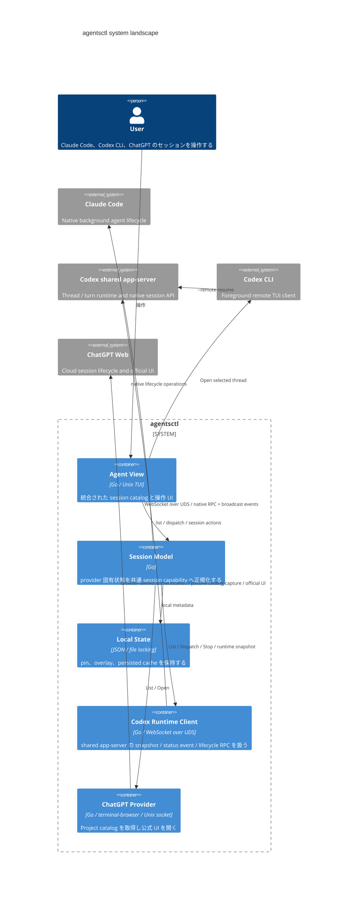

# DesignDoc: agentsctl

**Document Status:** Draft  
**Development Status:** TBD

## Abstract/Summary

agentsctl は、Claude Code のバックグラウンドエージェント、Codex CLI のセッション、設定された ChatGPT Project の conversation を、単一の Agent View から操作する Unix TUI である。

提供する共通操作は以下とする。

- List
- Dispatch
- Attach / Detach
- Stop
- Rename
- Archive
- Pin / Unpin

各 provider では、バックグラウンド実行の仕組みが異なる。
そのため、以下の非対称な実行モデルを前提とする。

- **Claude**
  - ネイティブなバックグラウンド実行環境を利用する。
  - セッションの実行主体は Claude 側が保持する。
- **Codex**
  - shared app-server daemon が thread / turn runtime を保持する。
  - agentsctl は daemon の native RPC / event を利用し、Open 時だけ foreground TUI client を接続する。
- **ChatGPT**
  - browser-owned authentication と ChatGPT の cloud lifecycle を利用する。
  - List と Open のみを提供し、interaction は公式 ChatGPT UI に委譲する。

各 provider のネイティブなライフサイクルを維持しつつ、Agent View 上では共通の UX を提供する。

### Provider runtime model

| 項目                 | Claude                  | Codex                                                        | ChatGPT                               |
| -------------------- | ----------------------- | ------------------------------------------------------------ | ------------------------------------- |
| バックグラウンド常駐 | Claude のネイティブ機構 | shared app-server daemon                                     | ChatGPT cloud                          |
| Session catalog      | `claude agents`         | `thread/list` + runtime snapshot / status event               | 公式 Project UI の passive capture    |
| Dispatch             | `claude --bg`           | `thread/start` + `turn/start`                                 | 非対応                                |
| Open / Attach        | `claude attach`         | foreground `codex --remote unix://... resume <thread ID>`     | terminal-browser app mode の公式 UI   |
| Stop                 | `claude stop`           | `thread/turns/list` + `turn/interrupt`                         | 非対応                                |
| Rename               | `/rename` via transient attach | Codex app-server                                      | 非対応                                |
| Archive              | agentsctl-local overlay | Codex app-server                                             | 非対応                                |
| Pin                  | agentsctl-local state   | agentsctl-local state                                        | agentsctl-local state                 |

## Background

Claude Code と Codex CLI は、どちらも継続可能なエージェントセッションを扱える一方で、バックグラウンド実行のライフサイクルやセッションへの再接続までの操作体験に大きな差がある。

agentsctl はこの provider ごとの差異を吸収し、複数セッションを一元的に管理する経路を提供する。

## Goals

- Claude、Codex、設定された ChatGPT Project のセッションを単一の Agent View から一覧・操作できるようにする。
- 以下を provider に依存しない共通操作として提供する。
  - list / dispatch / attach / detach / stop / rename / archive / pin

- Codex でも、foreground TUI client の lifetime と thread / turn runtime を分離し、TUI の終了後も同じ thread を継続・再 Open できるようにする。

## Non-Goals

- ChatGPT からの Dispatch、新規 conversation 作成、Stop、Rename、Archive
- Chat と Work を共通 model 上で区別すること
- Archive したセッションを Agent View から復帰させる操作
- agentsctl 独自の session / transcript 形式を持つこと
- Windows 対応

## Proposed Design

agentsctl は、Claude、Codex、ChatGPT を共通の session model として Agent View へ提示する。ただし、実際の lifecycle operation は provider ごとの能力へ委譲する。

agentsctl が補うのは、主に Codex に不足するバックグラウンド実行能力である。

### UX Design

#### Session catalog

Claude、Codex、ChatGPT のセッションを統合し、1つの一覧として表示する。

session は作成時刻が新しい順に並べる。Activity や runtime status の変化だけでは並び順を変更しない。これにより、バックグラウンド更新によって閲覧中の行が頻繁に移動することを防ぐ。

##### Grouping

一覧は Pinned group と unpinned group(s) に分ける。

- Pinned session は directory scope に関わらず常に単一の `Pinned` group へ集約する。scope が複数 directory を含む場合、Pinned row には directory path を表示する (directory を跨ぐため group heading だけでは判別できない)。
- Unpinned session は、表示対象の directory がすべて同一なら単一の `Recently created` group、複数 directory を含むなら directory ごとの group に分ける。directory ごとの group では、その heading が directory を示すため row 自体に directory を表示しない。

grouping は表示専用の分割であり、session domain には持ち込まない (`internal/session.Session` に group の概念は存在しない) 。selection identity は `session.Key` で保持し、scope cycling、refresh、pin、通常の reorder では同じ session を追従する。例外として、選択中の pinned session を unpin した場合は、移動した session を追わず、変更前の Pinned group 周辺、または unpin 後の visual order の先頭へ selection を移す。また、provider が session の identity transition (provisional key から canonical key への変更) を明示した場合は、selection は canonical key へ移る。

Directory group は session を10件単位で表示する。初期状態は先頭10件までとし、残りがあれば selectable な `Show more` row を末尾に置く。Composer が空のとき、`Show more` 上の `Enter` または `→` は次の最大10件を開き、最初に追加された session へ cursor を移す。session 上の `←` はその session を含む10件 block 以降を閉じ、先頭 block 上では group 全体を selectable な `Show sessions` row へ畳む。`Show sessions` 上の `Enter` または `→` は初期状態へ戻し、先頭 session を選ぶ。Pinned group は pagination せず、全 session を表示する状態と `Show sessions` だけを表示する状態の2つだけを持つ。

Fold / expansion level は永続化しない Agent View-local な runtime state であり、通常の catalog refresh、reorder、directory scope の切り替えをまたいで保持する。Pinned は固定 identity、directory group は grouping と同じ normalized directory key を identity とし、`Recently created` と directory path の heading 表示が切り替わっても同じ logical group として扱う。

List cursor は Agent View 内だけに存在し、session row の `session.Key`、または group identity と `Show more` / `Show sessions` kind の組を保持する。control row を fake `session.Session` や fake `session.Key` として表さない。session action は session cursor にだけ適用し、control cursor 上では session 未選択として扱う。rendering、Up / Down、`{` / `}`、viewport、fold / expansion、refresh 後の cursor reconciliation は、group heading と separator を含まない同一の derived selectable-list model を参照する。

Composer が空のとき、`}` は次の visible group の先頭 selectable row へ、`{` は前の visible group の末尾 visible session (fold 済みなら `Show sessions`) へ移る。前 group の末尾が `Show more` でも、その control は飛ばして最後の visible session を選ぶ。前後の group が存在しない端では、代わりに現在 group の先頭または末尾 selectable row へ移り、そこでは `Show sessions` / `Show more` も移動先に含む。両方とも group 間では wrap しない。Composer が空でなければ、`←` / `→` は prompt cursor を動かし、`{` / `}` は通常の文字として挿入し、`Enter` は prompt を dispatch する。

Refresh / reorder 後も、選択中 session の `session.Key` が catalog に残る限り同じ identity を維持し、その session が表示されるところまで group を開く。control row は stable group/control identity で維持し、control が消えた場合は変更前の visual order で次、前、先頭の順に surviving selectable row へ移る。

Composer から dispatch が成功したときだけ、`Dispatch` が返した `session.Key` を Agent View 内の一時的な選択要求として保持する。catalog は provider が所有する権威であり続けるため、Agent View は返された row を `Rows` へ挿入せず、その identity が catalog に現れるのを待つ。要求した key、または provider が明示した identity transition (`session.IdentityTransitions` で検証済み) によって canonical key へ移った先が catalog に現れた時点で、その session を選択して要求を消費する。選択時は既存の group visibility の仕組みで、その session が見えるのに必要な分だけ group を開く。要求された session が現れるまでは現在の選択に影響せず、後から dispatch が成功すれば古い未解決の要求は置き換える。rename 入力中は cursor を rename 対象に保つため解決を保留し、rename の確定または取消で入力が終了した時点で、reload を待たずに現在の catalog に対して再度解決する。通常の refresh、status 更新、rename、既存 session の更新は選択要求を作らないため、選択を奪わない。

##### Pin / Unpin

Pin 状態は agentsctl が永続化する。key は `session.Key` (`<provider>:<ID>`) である。session が identity transition を経た場合、provisional key に対する pin は canonical key へ移行され、provisional key の pin は残らない。

Pin / Unpin 操作は即時に表示へ反映するため、provider の catalog を再取得せず、現在の一覧へ ordering rule を再適用する。

選択中の pinned session を Unpin した場合、変更前の Pinned group で1つ下、下がなければ1つ上にあった session を選択する。他の pinned session がなく Pinned group が空になる場合は、pin state の変更、overview の再ソート、grouping / selectable list の再構築を行った後の visual order で先頭となる selectable row を選択する。unpin した session 自体がその先頭であれば、結果としてその session が再選択されるが、これは `session.Key` の追従ではなく unpin 後の visual position による選択である。Pin 操作と refresh/reload は引き続き同じ `session.Key` を追従する。

#### Lifecycle

Agent View では各 provider を共通の session model として扱うが、session の実体と実行主体は provider ごとに異なる。

**Claude**

- `claude agents` が提供する native session を session の実体とする。
- native lifecycle state を Agent View の共通 Activity へ変換する。
  - Working
  - Needs input
  - Waiting quota
  - Completed
  - Failed
- background session の実行主体と lifetime は Claude 側が保持する。
- agentsctl の TUI や attach client の lifetime とは独立して存在する。

**Codex**

- Codex app-server の thread を session の実体とし、canonical session key は常に `codex:<thread ID>` とする。
- shared app-server daemon が thread / turn runtime を保持する。agentsctl の TUI や foreground Codex TUI client の lifetime から独立して実行を継続する。
- agentsctl は daemon へ persistent connection を持ち、native runtime snapshot と `thread/status/changed` から Activity を得る。
- Activity と Runtime は別の signal として扱う。
  - daemon に loaded された `active` thread は `Working`、waiting flag がある場合は `NeedsInput`、`idle` は `Idle`、`systemError` は live state として `Failed`。
  - `systemError` は terminal state ではなく次の turn で回復しうる。unload 後まで Failed を推測して保持しない。
  - daemon で `notLoaded` かつ writer lock がなければ休止中として `ActivityIdle / RuntimeNone`。
  - daemon で `notLoaded` かつ writer lock があれば daemon 外の runtime が存在するため `ActivityUnknown / RuntimeExternal`。
  - daemon の状態を観測できない場合は `ActivityUnknown / RuntimeUnknown` とし、推測しない。
- Codex では turn completion を persistent な `ActivityCompleted` に変換しない。`turn/completed` は transient event であり、完了後の canonical thread state は `idle` である。
- title 生成などの ephemeral thread は session catalog / Activity observer から除外する。

**ChatGPT**

- agentsctl の起動 directory から親方向へ探索し、最も近い `.agentsctl.toml` を configuration root とする。
- 最も近い `.agentsctl.toml` が project boundary となる。そのファイルに `[chatgpt]` がない場合、さらに親の `.agentsctl.toml` から ChatGPT 設定を継承しない。
- `.agentsctl.toml` の `[chatgpt].project_id` が指定する1つの Project を catalog の対象とする。
- 設定ファイルを含む directory を全 conversation の logical CWD とし、共通の directory scope を適用する。
- normal Chat と Work は区別せず、どちらも provider `chatgpt` の session とする。
- local runtime を証明する概念を持たないため `RuntimeNone`、共通化できる activity signal を持たないため `ActivityUnknown` とする。
- cloud session の実行主体と lifetime は ChatGPT が保持し、agentsctl や browser view の lifetime から独立させる。

#### ChatGPT browser-backed provider

ChatGPT provider は `sessionctl.Source` と `sessionctl.Opener` に加えて `sessionctl.Refresher` と `sessionctl.Observer` を実装する (cache/refresh/observe の詳細は次節)。Agent View は provider ID で分岐せず、共通 capability と session key `chatgpt:<conversation_id>` を通じて List / Open / selection / local pin / refresh / catalog update を扱う。

List は永続 partition `agentsctl-chatgpt` で公式 Project view を開き、frontend 自身が発行する `/backend-api/gizmos/{project_id}/conversations` response を passive に観測する。設定された Project route ID と endpoint 内の opaque ID が一致することには依存せず、navigation generation と discovery WebContents の ownership によって capture scope を確定する。browser bridge は response body を browser-side で sanitize し、conversation ID、title、create/update time、cursor chain に必要な metadata のみを mode `0600` の local socket から Go へ渡す。credential、header、browser storage、transcript、raw response は bridge boundary を越えない。

同じ `cursor=0` を共有する異なる request series が存在しうるため、browser-side の endpoint identity と cursor 以外の relevant query parameters から `SeriesKey` を導出する。fresh series が1つだけなら DOM render count を条件にせず固定し、複数なら Project conversation link count と一致する first page が一意に決まるまで bounded load window 内で待つ。期限まで曖昧なら失敗する。cursor は opaque value として equality / cycle detection / unchanged forwarding だけに使い、terminal response は absent / `null` / empty string の互換 shape のみを受理する。

pagination は synthetic DOM event ではなく Electron の real mouse-wheel input を使い、現在の scroll region と増加しうる `scrollHeight` を毎 round 再取得して moving bottom を追う。明示的な terminal cursor page を観測した場合だけ List を成功させる。page 数、wheel tick/round、no-progress、cursor cycle に defensive bound を設け、terminal page へ到達できなければ partial list を返さず provider failure とする。provider 単位の partial failure により、この失敗は Claude / Codex catalog を失わせない。

sanitized row は server response order ではなく `CreatedAt DESC` と stable identity tie-break で整列する。remote の star / pin metadata は取り込まず、Pin は既存の agentsctl-local state だけを source of truth とする。

Open は同じ persistent partition を用いた terminal-browser app mode で `https://chatgpt.com/c/{conversation_id}` を開く。`Ctrl+]` は browser view のみを閉じ、cloud conversation を停止・削除しない。discovery preload と main script は runtime ごとの ownership token と terminal-browser session identity を handshake し、navigation、wheel、Network capture をその discovery WebContents だけに限定する。foreground Open や別の terminal-browser session は discovery target にならない。

foreground conversation の keyboard navigation は renderer preload 内で完結し、Go runtime や discovery IPC へ DOM 操作を持ち込まない。`.` の番号 jump は text-entry context と IME composition 中には開始せず、開始時点で viewport 内にあり HTML semantics / ARIA 上操作可能な element だけを採番する。番号 prefix の決定は DOM から独立した pure logic とし、overlay は fixed positioning、closed shadow root、`pointer-events: none` によって document layout と既存 target を変更しない。

user prompt は ChatGPT が現在提供する semantic metadata `[data-message-author-role="user"][data-message-id]` から操作ごとに再解決し、保持する現在位置は DOM node ではなく `initial` / message ID / `bottom` とする。対象 prompt には navigation 中だけ一時的な focusability を与え、prompt の scrollable ancestor へ移動する。最後の prompt の次は同じ scroll owner の末尾へ移動し、`bottom` からの next は末尾に留まり、previous は最後の prompt へ戻る。macOS の terminal-browser PTY で `{` / `}` は Shift 付き `BracketLeft` / `BracketRight` として renderer に届くため、prompt shortcut は `code` と modifier を組み合わせて判定し、unshifted `Ctrl+]` の close shortcut と分離する。

discovery renderer は初回 URL の ownership token を検証し、同じ token に結び付いた marker を browsing context の `sessionStorage` に保持する。Project page への full navigation 後もこの marker で identity を復元し、keyboard navigation を install せず、registration と catalog enumeration の既存経路だけを保持する。foreground browsing context には marker がないため navigation を install する。これにより hidden window が overlay を生成したり、navigation のために focus / scroll されたりする経路を作らない。

background discovery helper は agentsctl-owned PTY で維持し、provider Close / context cancellation では terminal-browser CLI へ `SIGTERM` を送り、bounded wait 後だけ強制終了して materialized bridge assets を削除する。この PTY lifecycle は stock terminal-browser に supported service mode がない現時点の実装上の制約であり、将来 provider boundary 内で置換できるようにする。

#### ChatGPT last-known-good catalog cache

`Source.List` は呼び出しのたびに full cursor enumeration を行わない。ChatGPT provider は内部に last-known-good な in-memory cache (`catalogCache`) を持ち、`List` はこの cache を即座に返すだけの純粋な読み取りになる。cache がまだ一度も埋まっていない場合 (persisted cache も存在しない場合 -- 後述) は remote failure ではなく空の成功 snapshot を返す。

**`List` は決して自ら remote work を開始しない。** 初回 refresh の起動責務は完全に `sessionctl.Refresher` 側にあり、Agent View 自身の reload cycle が `requestReload` から独立して `Refresh` を呼ぶ (次節 "Provider catalog observer と provider snapshot store" 参照)。以前は `List` が cache 不在を検知して自ら `Refresh` を呼ぶ実装だったが、これは同じ reload cycle 内で `requestReload` 自身も `Refresh` を呼ぶため、single-flight で衝突こそしないものの「初回 enumeration の直後にもう1回 coalesced follow-up が余分に走る」という無駄を生んでいた。`List` を純粋な cache 読み取りに限定することでこの重複を避けている。

cache の置き換えは COMPLETE な enumeration によってのみ行う。timeout、broken bridge、request series の曖昧性、schema drift、cursor cycle、pagination 未完了、context cancellation はいずれも「直前の cache (memory / persisted 双方) を保持したまま、今回の refresh は失敗として記録する」扱いになり、部分的な結果が cache に混入することはない。COMPLETE な enumeration が実際に 0 件の conversation を観測した場合はそれ自体が有効な置き換えであり、cache は空配列になる — これは「一度も enumeration が成功していない」状態とは区別する。

background refresh は `sessionctl.Refresher.Refresh(ctx)` で要求する。実行中の refresh がある間に追加で要求された場合は新たな enumeration を並行起動せず、実行中の1回が終わった直後に最大1回だけ追加の refresh を続けて走らせる (single-flight + coalescing)。これにより Ctrl+L の連打が discovery bridge の再起動や enumeration の重複起動を引き起こすことはない。

refresh の完了 (成功・失敗いずれも) は `sessionctl.Observer.Observe(ctx)` を通じて provider 単位の `ProviderUpdate` として publish される (Observer の一般的な semantics は Catalog loading 節を参照)。成功時は新しい cache 全体を full replacement として、失敗時は Sessions を持たない error-only の update として届く — 失敗を「session が0件になった」と誤読させないための区別である。publish は **latest-wins**: subscriber 側の buffer が詰まっている (= Agent View 側が一時的に読み出せていない) 場合でも、古い queued update を1つ捨てて最新の update を積み直す。Observer publication は event log ではなく「provider の現在状態」の full replacement であるため、遅れて追いついた subscriber が受け取るべきは常に最新の状態であり、途中に挟まった古い成功や失敗であってはならない。

cache 内の session は常に Open 可能な対象として扱う。Open は cache や in-flight refresh の状態を一切 preflight せず、対象の conversation ID へ直接遷移する。remote 側で削除されていた場合の挙動は公式 ChatGPT UI に委譲し、agentsctl 側が能動的に cache から evict することはない。runtime 内部でも List (enumeration) と Open は互いに排他しない: Open は discovery helper の起動確認だけを lock で保護し、enumeration 本体や browser view を開いている間の待機は lock の外で行うため、background refresh の最中でも Open は待たされない。

##### Persistence (agentsctl 再起動をまたぐ last-known-good catalog)

in-memory cache は、`internal/localstate.Store` (agentsctl の local state の Root Owner) を通じて disk 上の last-known-good catalog によって裏打ちされる。Provider construction (`New`) は、configured Project ID に対応する persisted catalog があれば同期的に in-memory cache へ hydrate してから返る -- browser process も network access も一切発生させない、純粋な local state の読み込みである。これにより、agentsctl を再起動した直後の最初の `List` から、前回成功した catalog の rows が (background refresh の完了を待たずに) 即座に返る。

persist される粒度は Project ID をキーにした catalog 全体で、以下を含む:

```text
conversation ID
title
create time
update time
catalog 全体の refreshed-at timestamp
```

以下は意図的に persist しない:

```text
session.CWD / config root         -- hydrate 時点の現在の Config.Root を常に使う
Actions / Pinned / Runtime / Activity / provider warning
refreshing / pending といった refresh state machine の状態
```

CWD を persist しないのは、リポジトリの移動や同一 Project を参照する別 checkout がある場合に、古い CWD がそのまま残ってしまうのを避けるため -- remote catalog (何がある conversation か) と local logical CWD (それが今どのディレクトリに属するか) は別の関心事として扱う。Local pin は既存の pin store がそのまま source of truth であり、ChatGPT catalog の persist/hydrate はそれに一切関与しない。

Provider は raw JSON schema や `localstate` の内部型に直接依存しない。`internal/provider/chatgpt` は自身の consumer-side interface `CatalogStore` (`ChatGPTCatalog`/`SaveChatGPTCatalog`) を所有し、`*localstate.Store` がそれを満たす。provider が必要とする storage / runtime dependency は同様に consumer-side interface 越しに受け取り、テストでは fake implementation に差し替えられる。

replace は COMPLETE な enumeration の後にのみ行われ、memory cache の更新と persist は同じ成功パス内で行われる:

```text
remote COMPLETE
  → normalize
  → memory cache replace (今回の refreshedAt で)
  → CatalogStore へ persist
  → Observer publish
```

**persistence failure は remote success を無効化しない**: disk 書き込みが失敗しても、memory cache の更新と Observer publish は既に完了しているためそのまま有効であり、取り消したり握りつぶしたりしない。

##### Catalog validity と local durability の区別

「今回の remote catalog が有効かどうか」と「その catalog を local に確実に保存できたかどうか」は別の問いであり、`sessionctl.ProviderUpdate` (`Observer` 参照) はこれを明示的に区別する:

```text
Err != nil, Sessions == nil, Warning == nil
  → remote refresh そのものが失敗した
  → 既存 sessions を保持したまま warning として Err を表示する

Err == nil, Sessions != nil, Warning == nil
  → remote refresh は成功し、local durability にも問題はない
  → sessions を丸ごと置き換え、warning を消す

Err == nil, Sessions != nil, Warning != nil
  → remote refresh は成功したが、local への persist に失敗した (durability の問題)
  → sessions は完全に有効なので丸ごと置き換え、選択・Open もそのまま可能なまま
  → warning として Warning を表示する (rows を隠したり古い rows に戻したりしない)
```

`Err` と `Warning` が同一 update に同時に立つことはない -- 「今回の refresh が失敗した」と「今回の refresh (は成功したが、その結果を保存する) local durability が劣化した」は独立した問いであり、provider はそのどちらか一方だけを、今回の refresh cycle が実際に該当する方だけを report する ("latest provider problem wins" -- 下記)。

ChatGPT provider はこの区別を `durabilityWarning` という1つの内部状態として追跡する:

- hydrate 時に persisted catalog の read/decode/validation が失敗した場合に set される。
- 成功した refresh の後段の `persist` が失敗した場合に set される。
- 成功した `persist` によって clear される (hydrate 由来であっても persist 由来であっても)。
- **remote refresh の失敗そのものによっては一切変更されない** -- 失敗した refresh は `Err` だけを publish し、`durabilityWarning` には触れない。これにより、たまたま次の refresh が (無関係な理由で) 失敗しても、まだ解消していない durability の問題を黙って見失うことはなく、次に refresh が実際に成功したタイミングで再び surface される ("latest provider problem wins": この refresh cycle 自身の結果 -- Err か、Warning か、あるいはどちらもないか -- だけが見える状態になり、`errors.Join` のように複数 cycle 分の問題を蓄積することはしない)。

hydrate 時に無効な persisted row (conversation ID の形式が不正、title が空、timestamp が zero value など) を検出した場合は、その catalog 全体を hydrate せず (部分的に corrupt な catalog を許容しない)、空の cache から始める。persisted state の read/decode 自体が失敗した場合も同様に、provider の起動やその後の remote refresh を妨げない。

いずれの場合も `durabilityWarning` は set され、Observer subscription が確立された時点 (`Observe` 呼び出し) で pending な durability warning があれば、その新しい subscriber へ直ちに1回、現在の cache (hydrate できていればその内容、できていなければ空) と Warning を1つの `ProviderUpdate` として publish する。これにより、construction 時点の hydration failure のように「まだ一度も refresh が起きていない」状況でも、その警告が Agent View 側から観測可能になる -- 次の成功した refresh を待って初めて (しかも成功時にしか) 見える、ということがない。

state.json 全体が読めない、あるいは decode できない場合の挙動は `internal/localstate` 既存の挙動にそのまま従う -- ChatGPT 固有の corruption recovery は追加しない。

#### Dispatch / Composer

Composer に入力した prompt を、選択中の provider へバックグラウンド dispatch する。

provider ごとの起動方法は異なるが、Agent View 上では同じ Dispatch 操作として扱う。

**Claude**

- native background dispatch を利用する。
- 起動後の session lifetime は Claude 側へ委譲する。

**Codex**

- shared app-server daemon を利用する。
- Dispatch は次の RPC sequence とする。

```text
thread/start
  -> canonical thread ID

turn/start
  -> response を待つ

thread/unsubscribe
  -> subscriber-only の turn event / approval / user-input request の delivery を解除
```

- `thread/start` の response で canonical thread ID を同期的に得るため、provisional run ID、baseline、CWD / writer lock による run-to-thread binding は持たない。
- `turn/start` の response を待ってから Dispatch 成功とする。失敗した場合は Dispatch error とし、turn のない thread を session catalog row として捏造しない。
- `thread/unsubscribe` の前に approval / user-input request が届く race があっても agentsctl は応答しない。request は thread 側に保持され、後から foreground TUI が Open されたときに再提示される。
- Activity は Dispatch connection の thread subscription ではなく、persistent observer が受け取る broadcast `thread/status/changed` から更新する。

###### Rename-only new session (Codex)

新規 session の Composer 入力が単独の `/rename <name>` である場合、その文字列を Codex の initial prompt として渡さない。Codex には通常 prompt として渡るためである。認識するのは入力全体がこの1コマンドである場合に限り、name が空なら Dispatch 前に validation error とする。

Codex は user/model turn を一度も持たない thread を durable な resumable/listable session として扱わない。このため rename-only でも固定の bootstrap turn を1回実行する。

```text
/rename <name>
  -> thread/start                 (canonical thread ID を取得)
  -> turn/start(bootstrap prompt)
  -> thread/unsubscribe
  -> thread が durable になった後に native thread rename
```

- bootstrap prompt は固定文とし name を含めない。name は user-controlled な文字列であり model instruction に埋め込まない。
- session identity は最初から `codex:<thread ID>` であり、bootstrap のための provisional run key や identity transition は作らない。
- bootstrap 中の Activity は通常の native thread status を使う。
- bootstrap turn は model turn を1回消費する。rate limit 等で失敗する場合も特別な回避はしない。
- native rename の失敗は rename failure として扱い、別 thread の推測や自動 retry は行わない。

##### Composer directory context

Composer が表示する `<cwd>` と、新規 dispatch が実行される directory context は、list cursor が持つ一意な directory context に追従する。

- session が選択中なら、その CWD を使う。
- Directory group の `Show more` / `Show sessions` が選択中なら、その group の normalized directory を使う。
- Pinned の `Show sessions` または選択可能な item がない場合は、一意な session / directory context がないため `StartupCWD` を使う (`StartupCWD` は runtime の `Runtime.CWD` から設定する)。起動 directory は、一意な context がある場合にその代わりとしては使わない。

表示 (`<cwd>`) と実際の dispatch context が異なる値を参照することは絶対に避ける — 同じ導出結果 (`State.ComposerCWD`) を両方が読む。

##### Contextual footer と Help view

Composer 下部には、常時固定の shortcut 一覧ではなく、現在の状態に応じた最小限の footer を表示する。

- `Ctrl+X` の表示 (`stop` / `archive`) は、選択中 session が実際に持つ Action availability から決める。provider ID による再判定は行わない。
- `Ctrl+G` は Composer の Vim 編集として contextual footer と Help view の両方へ表示し、directory scope cycle は `Ctrl+/` として Help view へ表示する。
- `?` と `Esc` の意味は prompt の空/非空、および help view の表示状態によって変わる。
- Help view は `State` の明示的な UI state (`HelpVisible`) として持つ。terminal decoder は `?` を単なる rune として渡すのみで、"help を開く" という意味付けは `State.Handle` 側で行う。
- Esc の優先順位は次の順で固定する: help visible なら (rename・confirmation の有無に関わらず) help を閉じるだけで prompt/rename/confirmation のいずれにも触れない、help が非表示かつ prompt が非空ならそれを消す、help が非表示かつ prompt が空なら (rename 中ならその rename をキャンセル、confirmation 中ならそれを解除、どちらでもなければ) 終了する。
- footer/help が参照する shortcut の物理 key と label は `keymap.go` の named `Binding` を単一の source of truth とする。footer 表示用に別途 key を持たない。

##### Usage capability

Claude/Codex の 5h・weekly 利用率は、`sessionctl` 側の任意 capability `UsageSource` として表現する。

- `UsageSource` を実装しない provider (Source のみの provider を含む) は、単に usage 行に現れないだけであり、Controller の動作を妨げない。
- 取得は provider ごとに並行して行い、一部 provider の失敗が他方の結果を握りつぶさない (Session catalog の "provider catalog の partial failure" と同じ方針)。
- 巨大な単一 `Provider` interface へ `Usage` を必須 method として追加することはしない。
- usage 取得は Agent View の rendering critical path に置かない。catalog は usage の成功/失敗/速度に関係なく即座に render 可能とし、usage は background で provider ごとに独立して取得・反映する (遅い/hung provider が他 provider の表示や画面の再描画を妨げない)。reload のたびに既知の usage を消すことはせず、新しい結果が届くまで直前の値を表示し続ける。
- ただし直前の値を無期限に表示し続けることはしない。各 provider の usage 行は、直近の成功した取得から一定時間 (5分) 以上経過している場合、または一度も取得できていない場合、percentage を `?%` の unknown placeholder として表示する — 古くなった値をあたかも現在値であるかのように見せない。claude/codex の行自体は常に表示し、取得未完了/stale を理由に行ごと非表示にはしない。この 5分ルールは provider 単位の粗い freshness ゲートであり、window 単位の reset boundary 判定 (下記) とは別の、独立した仕組みである。

**Normalized limit state (#19)**

`session.UsageWindow` は `Available bool` ではなく `State session.UsageLimitState` (`UsageUnknown` | `UsageAvailable` | `UsageExhausted`) を持つ。5h/weekly それぞれ独立にこの3値のいずれかを持ち、#20 のような caller はこの正規化された state だけを見ればよく、provider 固有のエラー文言や `Percent == 100` という慣習を解釈する必要がない。

- `UsageUnknown` (zero value): 一度も取得できていない、provider がその window をそもそも報告しない、reset boundary を跨いだためもう有効ではない、あるいは limit 以外の理由で refresh が失敗した — のいずれか。`Percent`/`Reset` に意味はない。
- `UsageAvailable`: 直近に取得できた実際の利用率。`Reset` (設定されていれば) はまだ未来。
- `UsageExhausted`: provider 自身が該当 window の limit 到達を報告した、有効な state transition。`Percent` は 100 固定 (表示上の convention であり、`Percent` から state を逆算することはしない)。

`Percent == 100` を exhausted の判定根拠にすることはない — 逆に `State` が先に決まり、`Percent` はそれに追従する表示値。同様に `Available == false` (旧モデル) 相当の「不明」を unknown/expired/exhausted のどれとも混同しない。

Agent View の rendering (`usageWindowText`) はこの `State` だけを見て分岐する: `UsageExhausted` → 常に `100%` (red)、`UsageAvailable` → 実際の percentage、`UsageUnknown` → provider 単位の stale placeholder と同じ `?%`。

**Codex**

app-server の `account/rateLimits/read` が返す window (`primary`/`secondary`) は position (どちらのフィールドに入っているか) では 5h/weekly を区別しない。各 window 自身が持つ `windowDurationMins` の値によって分類する。未知/欠落した duration は 5h/weekly のどちらへも推測せず、その window を `UsageUnknown` として扱う (fail closed)。Codex の transport には limit 到達を示す独自の signal がないため、Codex が `UsageExhausted` を報告することはない。

**Claude**

Claude Code には Codex app-server のような on-demand usage 読み取り RPC がないため、agentsctl が所有する専用の interactive Claude session (usage probe) を1つだけ持ち、その session 向け専用設定の `statusLine` から usage snapshot を収集する。

- probe session は agentsctl が生成・所有する session であり、既存のユーザー session を attach/hijack することはない。
- probe session の identity (native session ID) は agentsctl local state に保持し、通常は以後の起動でも同じ session を再利用する。名前や CWD だけを identity の根拠にはしない。ただし Claude Code が特定の session ID を "already in use" として恒久的に reject するケースが実機で確認されている (#19 follow-up) — この場合のみ、同じ `Probe.Usage()` 呼び出し内で session ID を rotate し、最大1回だけ retry する (無限 retry はしない)。rotate 後の ID も同じ probe directory を使い続けるため、後述の workspace trust 状態は rotate によって失われない。
- `probe.json` は複数 agentsctl process から共有されうるため、その load/create・workspace trust 更新・rotation は、`probe.json` 専用の advisory file lock (`probe.json.lock` への `flock`) 配下で1つの read-modify-write transaction として実行する。単に書き込み直前に persisted current を読み直すだけでは、read から write までの間に別 process が割り込む余地が残り不十分 — lock によって「read → 判定 → write」全体を1 transaction として直列化して初めて、reject された ID が既に他 process によって rotate 済みだった場合に新たな ID を発行せずその既存の rotate 結果をそのまま使う、という判定が race なく成立する。retry は rotate が実際に起きたかどうかに関わらず最大1回のまま変わらない。この lock は `Provider.List` 等の read-only アクセスまでは block しない (atomic rename により、読み取りは常に transaction 前後どちらかの完全な状態のみを見る)。
- probe 専用 directory は Claude Code にとって未知の directory であるため、初回起動時のみ workspace trust 確認への応答を行う。以後は Claude Code 自身がその directory を trusted として記憶するため、同じ応答を繰り返さない。この trust 状態は session ID ではなく probe directory に紐づくため、上記の session ID rotation が起きても agentsctl 側の trust 済みフラグは引き継ぎ、trust dialog への応答をやり直すことはない。引き継ぎ元は rotation を呼び出した caller が保持している (refresh 開始時点の) identity のコピーではなく、rotation を実行する時点で probe directory に永続化されている最新の identity である — 同じ refresh attempt の中で trust dialog への応答が完了し `TrustAccepted=true` が永続化された直後に session ID conflict が判明するケースがあり、その場合でも直前に永続化された最新の trust 済み状態を rotation 後の identity へ引き継ぐ。
- probe session は通常の session catalog (Agent View 上の一覧、pin/rename/attach/stop/archive の対象) には現れない。除外は agentsctl が記録している exact な session identity によって provider 境界で行い、CWD だけを条件にはしない。rotate によって使われなくなった旧 session ID も、Claude Code 自身の native catalog からは自動的には消えないため、agentsctl は rotate 済みの旧 ID も (現在の ID と合わせて) 引き続き保持・除外の対象とする — 除外は「現在の1つの ID」ではなく「agentsctl が probe として所有した exact session ID の集合」に対して行う。
- 取得結果は TTL 付きでキャッシュし、Agent View の reload のたびに probe session へ request を送ることはない。cache が stale な場合のみ refresh を行い、複数の呼び出しが同時に発生しても refresh は高々1回に集約する。この集約は同一 process 内の single-flight (`refreshShared`) に加えて、probe directory を共有する process 間でも `probe.json.lock` とは別の専用 refresh lock で行う (`probe.json` の identity mutation lock と responsibility を混同しない: こちらは Claude probe session の実行そのものを直列化する)。lock 取得後は必ず persisted `usage.json` を同じ TTL 基準で再確認し、待機中に別 process が既に fresh な結果を書いていればそれを再利用して Claude を再実行しない。lock は Claude との往復全体 (取得 → refresh → persist) を保持したまま解放するため、`ctx` cancellation を尊重する context-aware な acquisition を用いる。lock ordering は常に「refresh lock → identity lock」の一方向のみで、逆方向 (identity lock を保持したまま refresh lock を待つ) は発生しない。
- refresh が失敗しても、直前に取得できていた snapshot があればそれを返し、Session catalog や Codex 側の usage を道連れにしない。snapshot が一度も取得できていない場合のみ、この provider の usage を省略する (0% として偽装しない)。

_Limit detection (#19)_ — Claude Code の `statusLine` は `refreshInterval` による定期 tick で再実行されるため、tick が新しいというだけでは「この refresh が送った prompt に対する応答が実際に届いた」ことの証明にならない (installed CLI 2.1.263 で確認: 応答前の tick は `cost.total_api_duration_ms == 0` かつ `rate_limits` 自体が存在しない)。そのため probe は `cost.total_api_duration_ms` が正の値になった tick のみを「この refresh の実応答」として受理する。limit に到達した turn はこの意味での応答を得られないため、probe session 自身の terminal 出力 (以前は破棄していたもの) を limit 到達を示す文言について classify し、この判定だけで Claude provider 境界内に閉じる (統一 rate_limits JSON の解析結果ではなく、terminal 出力の文言に依存する数少ない箇所であり、TUI や provider-neutral domain へは一切漏らさない)。判定は「hit/reached your session limit」「hit/reached your weekly limit」等、具体的な句にのみ一致させ、"limit" という単語単体では判定しない — 同じ CLI バイナリが `context limit` / `token limit` のような無関係な意味でも同じ単語を使うため。5h/weekly いずれか、または両方を独立に `UsageExhausted` として正規化し、影響を受けない側の window は直前の有効な snapshot を保持したまま返す。limit 以外の理由 (timeout・process failure・parse failure) による失敗は、この classify に一致しない限り従来どおりの stale-cache fallback 動作を維持する。検出した exhausted snapshot は (通常の snapshot と同じ SnapshotStore 経由で) probe 自身の `usage.json` にも永続化する — limit 到達時は statusLine collector 自身が書き込む機会を持たないため、ここで明示的に書かないと agentsctl 再起動時に reset 前の percentage へ巻き戻ってしまう。

_Reset boundary (#19)_ — cache 上の snapshot は、それが observe された時点の usage window に対してのみ有効な値である。この判定ルールは Claude provider 内に閉じず、provider-neutral `session.UsageWindow.At(now)` / `session.Usage.At(now)` として一箇所に定義する: window ごとに独立して「現在時刻が、その reading が持つ `Reset` 時刻を過ぎていないか」を確認し、過ぎていれば `UsageAvailable`/`UsageExhausted` を問わず `UsageUnknown` として扱う — reset 前の percentage や exhausted state を、reset を跨いだ新しい window の値として維持することはない。Claude provider は自身の cache を `session.Usage` へ変換する際にこの `At` を一度適用し (`toSessionUsageWindow` 自体は reset 判定を持たない純粋な shape 変換)、Agent View はさらに自分の read/render 時点でも同じ `At` を再適用する (`usageWindowText`) — provider 側の refresh が起きていなくても、State に保持され続けている値が reset boundary を跨いだ後は次の render で `?%` になる。両者が同じ method を呼ぶことで、「Claude provider 内では正規化済みだが Agent View state 内では expiry 済み」というズレを防ぐ。`now` は `time.Now()` を各所に散らすのではなく `Probe.Clock` という単一の injection point を通す (Claude 側の deterministic test のため)。5h と weekly は互いに独立に評価され、片方が reset boundary を跨いでも、もう片方のまだ有効な snapshot には影響しない。

##### Claude probe: resource ownership とライフサイクル

Claude usage probe が扱う machine-global / process-local resource の owner を固定する。実装のクラス名は将来変わりうるが、ownership の構造自体 (「どこからでも読み書きできる」を作らないこと) は変えない。

| Resource                                                          | Scope          | Owner                     |
| ------------------------------------------------------------------ | -------------- | -------------------------- |
| probe identity (session ID・retired ownership・trust metadata、`probe.json`) | machine-global | `probestate.IdentityStore` |
| persisted usage snapshot (`usage.json`)                            | machine-global | `probestate.SnapshotStore` |
| Claude probe session の実行そのもの (refresh lock・freshness re-check・retry/rotation lifecycle・persist) | machine-global | refresh coordinator        |
| in-memory snapshot cache                                           | process-local  | `Probe`                     |
| in-process refresh single-flight                                   | process-local  | `Probe`                     |
| 1回の Claude PTY attempt (settings・PTY・settle・trust 送信・prompt 送信・detach) | attempt-local  | attempt runner              |

**Mutation authority**

- `probe.json` への書き込みは `probestate.IdentityStore` の domain operation (`LoadOrCreate` / `MarkTrustAccepted` / `Rotate`) を経由してのみ発生する。生の read-modify-write を組み立てられる箇所は `probestate` package の外には存在しない -- transaction lock (`probe.json.lock`) は同 package 内の実装詳細として閉じる。
- `usage.json` への書き込みは `probestate.SnapshotStore.Save` のみが行う。legacy schema decode (`available bool` → `state`) も同じ persistence boundary の内部に閉じ、domain/orchestration code は wire schema を意識しない。
- freshness (TTL) 判定は `probestate.SnapshotFresh(observedAt, now, ttl)` という1つの pure policy にのみ定義し、process-local cache の freshness 判定と machine-global の persisted snapshot re-check の両方がこれを呼ぶ (どちらも実時刻ベースで、テスト用の `Probe.Clock` は reset boundary 判定にのみ使う -- OS wait/timeout や TTL freshness のような wall-clock 由来の判断まで無理に testable clock 化はしない)。reset boundary 判定は従来通り provider-neutral `session.Usage.At` に一本化されたまま。

**Refresh lifecycle (owner: refresh coordinator)**

```text
Usage
│
├─ local fresh cache (Probe)
│    └─ return
│
└─ stale/missing
     ↓
process single-flight (Probe)
     ↓
machine refresh lock (coordinator)
     ↓
persisted snapshot re-check (coordinator -> SnapshotStore)
│
├─ fresh
│    └─ reuse
│
└─ stale/missing
     ↓
identity load/create (coordinator -> IdentityStore)
     ↓
attempt #1 (attempt runner)
     │
     ├─ success / exhausted -> persist snapshot
     │
     ├─ session conflict
     │    ↓
     │  IdentityStore.Rotate
     │    ↓
     │  attempt #2 (attempt runner, no further retry)
     │    │
     │    ├─ success / exhausted -> persist snapshot
     │    └─ error (conflict again, or other) -> stale/error fallback
     │
     └─ other failure       -> stale/error fallback (no rotation)
```

retry は attempt #1 が session conflict を報告した場合の attempt #2 のみで、それ以上のループはない。retry/rotation policy は coordinator だけが所有する。attempt runner 自身は retry しない。session conflict は attempt runner が probe session の出力を分類して返すだけであり、rotate するかどうかの判断は coordinator が行う。

**Lock ordering**

refresh lock (coordinator) を先に取得し、その内側で identity lock (`probestate.IdentityStore` の内部実装詳細) を都度取得・解放する。逆順 (identity lock を保持したまま refresh lock を待つ) は発生しない -- identity lock を握れるのは `IdentityStore` の domain operation 実行中だけであり、それらは常に coordinator の refresh lock 配下からしか呼ばれない。

`Provider.List` の読み取り専用アクセス (`IdentityStore.KnownSessionIDs`) はどちらの lock も取得しない -- atomic rename により、読み取りは常に transaction 前後どちらかの完全な状態のみを見る。

**TrustAccepted の意味**

`TrustAccepted` は Claude ディレクトリ自体の trust state の source of truth ではない。agentsctl が workspace trust flow (dialog への応答) を一度完了し、同じ blind keystroke を再送しないために保持するローカル metadata であり、常にこの意味でのみ扱う。

##### Prompt stash

Composer は、1つの共有 prompt stash を持つ。

stash の特徴:

- provider 間で共有する。
- directory scope 間で共有する。
- 選択 session には紐付かない。
- memory 上だけに保持する。
- agentsctl 終了時に破棄する。

Attach 中は terminal input を対象 CLI へ渡すため、Composer / stash の操作とは分離する。

##### Vim prompt editing

`Ctrl+G` は Composer の prompt 全文を foreground の `vim` で編集する。editor 選択は固定であり、`$EDITOR` / `$VISUAL` や provider 固有 behavior は参照しない。terminal decoder は `Ctrl+G` を物理 key として渡し、`State.Handle` が semantic intent へ変換し、temporary file・process・terminal mode の操作は Runtime の external boundary が担当する。

temporary file は prompt 本文だけを private file として保持する。logical prompt の末尾へ structural LF を1つ追加して Vim へ渡し、読み戻し時には CRLF / CR を `\n` へ正規化した後、末尾の structural LF をちょうど1つだけ除く。このため Vim が通常付与する EOF newline は Composer の意図しない空行にならず、prompt が元から持つ末尾改行は失われない。

Vim 起動前の Composer を snapshot とし、Vim が正常終了して temporary file を読み戻せた場合だけ保存内容へ置き換える。`:q!` の未保存変更、Vim の起動・終了失敗、file read failure では snapshot を維持する。editor から戻ること自体は dispatch / session start を一切生成せず、送信には従来どおり明示的な submit が必要となる。stash は Vim の保存内容を適用しても変更しない。

##### Multiline paste

terminal の入力は、物理 key か貼り付けかのどちらか1つの event に decode され、その後で Agent View の state が Intent へ解決する。

```text
terminal bytes
  -> physical KeyEvent or PasteEvent
  -> Agent View state
  -> Intent
```

Agent View が overview を所有している間は bracketed paste mode (DECSET 2004) を有効にする。terminal からの `ESC[200~ ... ESC[201~` は、read の境界にかかわらずちょうど1つの PasteEvent になる。PasteEvent は物理 key ではないため `Key` の値としては表さない。marker は内容に含まれず、payload の内側は CR / LF / ESC / 制御 byte / escape sequence を含めてすべて貼り付けられた内容であり、key や escape sequence としては解釈しない。payload の長さに固定の上限は設けず、終端 marker の前に入力が尽きた paste は破棄して読み取りを終える。

改行の正規化は terminal decoder ではなく、貼り付けた text を editor model へ適用する境界で行う (CRLF、次に単独の CR、を `\n` へ)。decoder は payload を加工せず渡す。

PasteEvent は現在の text-edit target の cursor 位置へ挿入する。既存の内容は置き換えず、cursor は挿入した text の末尾へ移り、位置は Composer と同じ rune index で数える。inline rename 中は rename の入力欄が target になる。rename は単一行であり (Claude の native rename は PTY へ `/rename <name>` を入力するため、name 内の改行は途中で submit されてしまう)、貼り付けた改行は空でない行を1つの空白で連結して取り込む。confirmation の pending 中は、通常の文字入力と同様に paste は何もしない。

paste / input の decode は model data を変更せずに保持する。ただし、user が制御する text (composer の prompt、rename の draft、session title、外部由来の error / warning / directory の文字列) は、Agent View 自身の trusted な ANSI styling と合成される前に、terminal-safe な表示可能表現へ符号化する。model の text が ESC / C0 / C1 文字を含むというだけで terminal control として実行されてはならない。

- 符号化は描画の境界 (user text が ANSI と合成される直前) で行い、完成した frame 全体から ESC を除去することはしない。Agent View 自身が color・cursor・alternate screen などに ANSI を使うためである。以降の `styleText` / `clipLine` / `lineCells` は、ESC を trusted な application ANSI の開始としてだけ扱う。
- 表示は 1 rune を 1 rune へ写す。C0 (U+0000-U+001F) は Control Pictures (U+2400-U+241F)、DEL は U+2421、C1 (U+0080-U+009F) は U+FFFD とし、それ以外は変更しない。不正な UTF-8 の byte (8-bit の C1 制御として解釈され得る単独の 0x80-0x9F を含む) も 1 byte ごとに U+FFFD となり、表示は常に妥当な UTF-8 になる。model 上の rune index (composer / rename の cursor、reserved command の span) が表示上でもそのまま同じ位置を指す。
- model data は保持する。paste した TAB や ESC も `Composer.Prompt` と dispatch の payload にそのまま残り、表示だけが変わる。provider が保持する session title も書き換えず、描画時にだけ符号化する。

paste は editor の変更だけであり、payload の改行が何個含まれていても dispatch / open / rename を生成しない。貼り付けた全文を1つの prompt として送るのは、その後に物理的な plain Enter が押されたときだけである。

##### Multiline cursor navigation

prompt が複数行になっている間は、`↑` / `↓` は session selection ではなく Composer 内の行移動を優先する。単一行 (空を含む) の間は従来どおり session selection を移動する。

この優先順位判定は `State.Handle` が行い、terminal decoder (`input_unix.go`) は物理 key (`KeyUp` / `KeyDown`) を渡すだけで prompt の内容を意識しない。行移動時の column 保持は一般的な text editor の挙動 (短い行を経由して長い行へ戻ると元の column を維持する) に合わせる。

#### Attach / Detach

Attach すると、Agent View から対象 CLI へ terminal を明け渡す。

Detach すると、session を停止せず Agent View へ戻る。

Agent View の raw mode と overview 固有 terminal mode は1つの lifecycle boundary が所有する。foreground の Vim へ terminal を明け渡す場合は overview mode を解除して Agent View 起動前の terminal mode を復元し、Vim の終了後は raw / overview mode を再取得して full redraw する。Vim の実行中は Agent View の key read を開始せず、terminal ownership の再取得に失敗した場合は次の key loop を開始せず cleanup して終了する。overview 固有 mode が増える場合も、この同じ boundary の enter / leave に集約する。

overview が所有する terminal mode は raw mode、alternate screen、cursor の非表示、bracketed paste である。overview が active な間だけこれらを所有し、foreground の Open / 外部 editor は overview の suspend の後にはじめて terminal を受け取る。Open は provider を区別しない共通の foreground handoff であり、`suspend -> Open -> resume` の順に実行する。Open が失敗しても resume は必ず試み、suspend に失敗した場合は Open を実行しない。resume に失敗した場合は Open の error と合わせて (どちらも失わずに) terminal ownership の失敗として扱う。戻ったときの resume が overview 所有の mode (bracketed paste を含む) をすべて再確立する。

attach client や Codex Open の PTY bridge が自身の attach 中に確立する bracketed paste (「PTY attach and redraw」、Codex の Open) は overview の mode とは別の ownership scope であり、overview が代わりに所有することはしない。overview の suspend が bracketed paste を解除した後に attach が自ら確立し、attach の終了時に解除し、overview の resume が再び確立する。

**Claude**

- `claude attach` を agentsctl が用意した PTY 上で起動する。
- Detach では、まず Claude attach client 自身の detach mechanism を利用する。
- attach client が終了しない場合のみ、agentsctl が所有する attach client の process group を終了する。
- Claude の native background session 自体には signal を送らない。

**Codex**

- Open は background runtime そのものへ PTY attach する操作ではなく、同じ shared app-server daemon に foreground TUI client を接続する操作とする。
- endpoint を明示して次の形で起動する。

```text
codex --remote unix://... resume <thread ID>
```

- plain `codex resume` は daemon unavailable や特定 option で embedded runtime へ silent fallback しうるため、agentsctl の Open では使わない。explicit `--remote` は接続失敗時に embedded runtime へ fallback しない。agentsctl 側も、foreground client の失敗を plain `codex resume`、managed PTY、embedded runtime のいずれでも再試行せず、そのまま Open の error とする。
- `--remote` の socket path は daemon lifecycle response の `socketPath` とし、`unix://` に続けて encode せずそのまま1つの引数として渡す。
- `resume` へ渡すのは canonical thread ID だけである。canonical thread ID を持たない row (移行期間中の legacy provisional run 等) は Open 不可とし、Provider 境界でも current run state を読み直して拒否する。
- 起動前に daemon を確保し、同じ daemon へ Open 専用の短命 connection で `thread/read` を行って current status を確認する。Observer の snapshot や row の Actions は advisory であり、安全性判断の source of truth にしない。status を確定できない場合 (接続・initialize・`thread/read` の失敗、不正な response) は起動しない。
- title 生成用の internal thread (`ephemeral` かつ `threadSource == "thread_title"`) は Open しない。
- foreground TUI は agentsctl の environment を継承し、`CWD` で、Open 中だけ存在する ephemeral な PTY bridge 上で実行する。

```text
Agent View (suspend)
  -> Open-scoped PTY bridge (agentsctl process 内)
       -> codex --remote unix://... resume <thread ID>
  <- Ctrl+] を agentsctl が intercept
  <- foreground client の process group だけを終了・reap
Agent View (resume)

shared daemon / thread / turn は bridge の外にあり、影響を受けない
```

- PTY bridge は transport であり session runtime ではない。run ID・localstate・thread identity を持たず、turn の実行を所有せず、detach / client 終了後に保持しない。再 Open は新しい foreground client と新しい PTY を作る。legacy の supervisor-managed background PTY が managed Codex process の lifetime と run identity を所有していたのとは異なり、bridge が所有するのは1回の Open の間の foreground client process だけである。
- child PTY は child の起動前に raw mode にし、outer terminal と同じ size にする。起動直後の control byte が kernel の line discipline に signal として解釈される race を避けるためである。child は PTY を controlling terminal とする新しい session / process group で起動する。その後は outer terminal の resize (`SIGWINCH`) ごとに PTY の size を直接更新する。
- 入力は Claude と同じ `terminal.DetachScanner` を通して relay する。`Ctrl+]` (literal byte、modifyOtherKeys、CSI-u) を検出すると、それ自体と同じ read のそれ以降の bytes は child へ渡さない。bracketed paste 内の byte は detach とみなさない。
- bridge は client の実行中、outer terminal の raw mode、transport 所有の alternate screen、bracketed paste を所有する。child 出力の alternate-screen leave (DECRST 1049) は physical terminal への境界でだけ除去し、child (と child が起動する external editor) の画面遷移を transport 所有の alternate screen 内に閉じ込める。解除は child の reap と出力転送の停止の後に、bracketed paste、alternate screen、raw mode の順で行う。正常終了・detach・起動後の失敗・出力失敗・context cancel のいずれでも同じである。
- detach では server へ RPC を送らず、foreground client の process group へ `SIGHUP`、`SIGTERM`、`SIGKILL` の順に、各段で短い timeout (1秒) だけ応答を待って送り、client を必ず reap する。reap 後に process group に残った process は `SIGKILL` で終了する。既に終了していること (`ESRCH`) は失敗ではない。Codex TUI の `Ctrl+C` から出る "Run in background" などの UI 操作は、UI state と実装詳細に依存するため用いない。
- 結果は終了の原因で区別する。`Ctrl+]` による detach は、signal による client の非 0 終了を伴っても Open の成功である。detach によらない client の非 0 終了 (remote 接続失敗を含む) は Open の error、context cancel は client を reap した後に context の error とする。
- foreground client の終了 / detach は thread / turn を停止しない。client の終了で閉じる connection について、shared daemon は connection の subscription を除くだけで、turn の interrupt や thread の shutdown は行わない。pending の approval / user input は thread 単位で保持され、次に attach した connection へ再提示される。Open の後始末で Stop、`turn/interrupt`、`thread/unsubscribe`、daemon の停止を行わない。再 Open では同じ canonical thread ID を使う。
- daemon が loaded として報告する thread は shared daemon 自身が writer lock を保持するため、writer lock を確認せず Open できる。
- daemon が `notLoaded` で writer lock がない休止 thread は、shared daemon 上へ resume して Open できる。
- `notLoaded` かつ writer lock がある thread は daemon 外の runtime が存在するため `RuntimeExternal` とし、その writer と競合する Open / destructive operation は fail closed とする。その writer が agentsctl の legacy managed run であっても同じである。

#### Session actions

既存 session に対して、Stop / Archive / Rename を提供する。

これらは異なる状態へ作用する独立した操作とし、他の操作を暗黙に伴わない。

##### Stop

Stop は、session に紐づく実行中の process を終了する。

**Claude**

- native stop を利用する。
- agentsctl 側で独自 process lifecycle を持たない。

**Codex**

- Stop は Codex process の kill ではなく、shared app-server 上の active turn を native RPC で interrupt する。
- Stop の時点で `thread/turns/list` から `inProgress` turn を取得し、その turn ID に `turn/interrupt` を送る。
- turn ID は daemon restart 後に変化しうるため cache しない。
- approval / user-input 待ちも active turn として interrupt でき、pending request は破棄される。
- interrupt 後も thread 自体は残り、次の turn を開始できる。
- daemon 外の writer しか確認できない thread は process を推測して停止せず fail closed とする。

Stop は以下とは独立する。

- Detach
- Archive

##### Archive

Archive は、既存 session を通常の Agent View から除外する。

**Claude**

- agentsctl-local overlay とする。
- 以下には変更を加えない。
  - native session
  - transcript
  - worktree

**Codex**

- app-server の native archive を利用する。
- daemon 外の active writer が存在する thread は、ownership を推測して archive しない。

実行中の session は Archive できない。

Archive が暗黙に Stop を実行することもない。

##### Rename

Rename は、既存 session の表示名を変更する。

**Claude**

- Claude 自身が保持する session を native に rename する。
- 実装上は、agentsctl が transient (使い捨て) な `claude attach <id>` client を起動し、Claude 自身の `/rename` slash command を送信したうえで、その attach client だけを detach する。
- session ID・sessionId・pid・実行中 process のいずれも変化しない。working session に対して行っても実行を中断しない。stopped session は `claude attach` 自身が worker を respawn して起こすため pid は新しくなるが、session ID・sessionId は変化しない。
- `/rename <name>` は bracketed paste で入力し、直後の CR で submit する (1回の write)。bracketed でない入力は、1回の塊が64文字以上だと Claude の composer に paste として扱われ、CR が改行として挿入されるだけで submit されないため (#75)。name は制御文字を含まないことを検証済みのため、paste を途中で閉じることはできない。
- `/rename` は、native catalog がその session の worker の `status` を報告してから (worker の REPL が起動済みになってから) 送信する。stopped session では REPL の起動前に届いた入力が Claude の early-input capture に取り込まれ、escape sequence は捨てられ、CR は改行になるため submit されない。固定の待ち時間には頼らない。
- rename 成否は、attach client 自身の終了確認ではなく `claude agents --json --all` による native catalog の再取得で判定する。attach client の detach 自体が失敗しても、catalog が新しい名前を確認できていれば rename は成功として扱う。
- native catalog confirmation (rename の完了判定) と attach client の cleanup (lifecycle の後始末) は並行して行う。cleanup は rename の成否そのものには関与しないため、user-visible な完了を cleanup の完了で遅延させない。ただし、agentsctl 自身のプロセス寿命内で attach client を残さないため、呼び出しは cleanup の完了も待ち合わせたうえで返る。
- `claude --bg --resume <id> --name <name>` は使用しない。別 session (別 ID) を生成することが確認されているため。
- 過去バージョンの agentsctl-local overlay (`state.Data.ClaudeNames`) は、native catalog が名前を持たない session に対してのみ表示上のフォールバックとして残る。native rename が成功した session については、そのタイミングで overlay を削除する。

**Codex**

- app-server の native rename を利用する。
- 新規 session の `/rename <name>` は、thread が存在しないため直接は適用できない。「Rename-only new session (Codex)」を参照。

#### Directory scope

Agent View は、agentsctl を起動した directory (target directory) を基準に3つの scope を持つ。

| Scope                            | 対象                                                                     |
| --------------------------------- | ------------------------------------------------------------------------ |
| `same directory`                  | target directory と CWD が一致する session                               |
| `descendants + worktree directories` | target directory 自体とその descendant、および同じ repository に属する worktree directory (とそれぞれの descendant) |
| `all directories`                 | 全 session                                                               |

scope は以下の順で切り替える。

```text
same directory -> descendants + worktree directories -> all directories -> same directory
```

selection identity (`session.Key`) と scope cycling は独立している。scope を切り替えても選択中 session が引き続き catalog に存在すれば選択は維持される。

##### Worktree discovery

`descendants + worktree directories` scope が必要とする worktree directory の一覧は、`git worktree list --porcelain` を用いた git/filesystem I/O で取得する。

この discovery は `internal/session` の pure な `Filter` の外側 (`internal/workspace`) に置き、以下の dependency direction を守る。

```text
git/filesystem discovery (internal/workspace)
        -> normalized scope roots / worktree directories
        -> pure session filtering (internal/session.Filter)
```

`internal/session.Scope` は discovery 済みの worktree directory を `WorktreeDirectories` としてそのまま受け取るだけであり、git や filesystem を一切呼び出さない。worktree discovery が失敗する場合 (git repository でない、`git` が利用不可など) は、target directory 自身の descendant のみへ安全にフォールバックする — scope 全体を失敗させない。

##### Path matching

`descendants + worktree directories` は path boundary を考慮する。

例えば以下の場合:

```text
/project
/project/src
/project-other
```

`/project` を基準とした scope に含むのは以下。

```text
/project
/project/src
```

`/project-other` は含めない。

単純な文字列 prefix matching は使用しない。この判定は `/project` (target directory) だけでなく、各 worktree directory を root とした場合にも同様に適用する。

##### Symlink

基準 directory は logical path として扱う。

symlink は解決しない。

##### Persistence

Directory scope は表示状態であり、永続化しない。

#### Feedback and confirmation

operation の結果が UI の変化から明確に分かる場合、追加 notification は表示しない。

例:

- session が追加される
- editor が閉じる
- pin によって行が移動する
- archive confirmation が消える

##### Composer 上部の notification area

Composer 上部の notification area は、global な通知を1行だけ表示する。内容は以下で、上ほど優先する。

1. Error (`State.Error`)
2. Update available notice (`State.UpdateAvailable`)
3. 何も表示しない

Error の例:

- 操作が拒否された
- provider が利用できない
- capability がない
- 入力値が不正

Update available notice は通知ではなく状態であり、Error とは独立に保持する。一時的な action error が表示されている間だけ隠れ、Error が消えると再び表示される。generic な通知を `State.Error` に載せない。

##### Row notice

特定 session にだけ関係する notice は、その session row に表示する。

Archive confirmation は row notice として扱う。

確認状態は session identity に紐付けるため、以下をまたいでも同じ session に追従する。

- Refresh
- Pin / Unpin
- Reordering

##### Width priority

terminal width が不足する場合、表示優先度を設ける。

優先する情報:

1. Provider
2. CWD
3. Row notice
4. Title

session の識別に必要な情報を優先し、補助情報から省略する。

#### Self-update

agentsctl は、起動時に GitHub Releases の最新安定版を1回だけ非同期に確認し、より新しい version があれば notification area に表示する。

```text
! agentsctl update available (v1.0.0 -> v1.1.0): /update to update
! agentsctl update available (v1.0.0 -> v1.1.0): https://github.com/tingtt/agentsctl/releases
```

上は `go` が使える場合、下は使えない場合である。自動 update は「新しい release を検出済み」かつ「`go` が使える」場合に限る。

##### Application version

running version の source of truth は `internal/version.Version` (既定値 `dev`) であり、ldflags の `-X` で埋め込む。

- Release build: `.github/workflows/release.yml` が push された tag を埋め込む。
- `/update`: `go install` に通知した version と同じ値を `-ldflags -X` で渡す。
- 埋め込みのない build (`dev`) は update check を行わず、`/update` も利用できない。

Go の build info は fallback として使わない。この version は agentsctl release version の source of truth とし、provider runtime の protocol/version 判定とは分離する。

##### Update check

- `internal/selfupdate` が GitHub の latest release API から tag を取得し、semantic version として検証してから running version と比較する。latest が新しい場合のみ通知する。
- check は background で行い、結果は event channel 経由で Agent View の event loop だけが State に反映する。初回描画とキー入力は待たない。
- network error、timeout、不正な response、不正な version はすべて非 fatal とし、`State.Error` にも表示しない。draft / prerelease は対象外とする。

##### `/update`

`/update` は agentsctl が所有する reserved command であり、Claude / Codex の Dispatch には到達しない。command token が認識された時点で agentsctl 内で処理を完結する。

- 引数付き (`/update foo`)、update 未検出、`go` なし、実行中の重複は、provider へ送らず local error とする。
- `/update-foo` は `/update` ではなく通常の prompt として扱う (reserved command の token 規則は `/rename` と同じ)。
- 通知に表示した version をそのまま `go install <module>/cmd/agentsctl@<version>` に渡す (`@latest` は使わない)。install 中に新しい release が出ても version は変わらない。
- `go install` は background で実行し、Agent View を止めない。二重実行は防ぐ。
- install の失敗は通常の error として表示し、現在の process は動き続ける。

##### Restart

install 成功時、event loop は `Restart` request を保持して終了する。`Runtime.Run` の defer が overview terminal (raw mode、alternate screen) を復元した後に、`cmd/agentsctl` が process replacement (`exec`) を行う。Agent View が terminal を所有している間は `exec` しない。

- 新しい binary は Go の install 先 (`GOBIN`、なければ最初の `GOPATH/bin`) の `agentsctl` であり、`PATH` 上の `agentsctl` とは限らない。
- 引数 (`os.Args[1:]`)、環境変数全体 (`CODEX_EDITOR`、`AGENTSCTL_STATE_DIR` を含む)、working directory を引き継ぐ。

agentsctl 自身の update は Codex shared app-server daemon を停止・再起動しない。新しい agentsctl process は起動後に daemon へ再接続し、runtime snapshot を取り直す。daemon lifecycle は Codex 側が保持する。

### Implementation Design

#### Design principles

実装全体では、以下を基本原則とする。

1. **Native state is canonical**
   - provider が所有する session state を source of truth とする。
2. **Local state is supplemental**
   - agentsctl 固有の metadata のみ保持する。
3. **Provider differences stay explicit**
   - provider 間の runtime model の差を無理に同一化しない。
4. **Process operations fail closed**
   - ownership や identity を証明できない process には介入しない。
5. **TUI lifetime and agent lifetime are separated**
   - TUI の終了が background agent の終了を意味しない。

#### Landscape



この図は概念上の責務境界を示す。

Go package の構成そのものは規定しない。

#### Common session model

Agent View は provider 固有 object を直接扱わず、共通の session model へ正規化する。

主な情報は以下。

- Provider
- Native session identifier
- Previous keys (provider が明示する identity continuity がある場合のみ)
- Display name
- Summary
- CWD
- Created time
- Updated time
- Activity
- Runtime ownership
- Archive state
- Pin state
- Capabilities

Capabilities には以下を含む。

- Attach
- Stop
- Rename
- Archive
- Unarchive
- Respawn

UI は provider 名だけで操作可否を判断せず、各 session が持つ capability を基準に action を提供する。

#### Native state and local overlays

provider の native state を canonical state とする。

agentsctl は native session record や transcript を複製せず、agentsctl 固有の metadata のみ local state に保持する。

##### Local state

主に以下を保持する。

- Pin
- Claude Archive overlay
- ChatGPT の persisted last-known-good catalog (Project ID ごと -- 前述の "Persistence" 節参照)

Claude session の表示名 (`ClaudeNames`) は、native rename 導入以前の overlay が migration compatibility として残るのみで、新規 rename の保存先ではない。

Claude の既知作成時刻 (`ClaudeCreatedAt`) は完全な native `sessionId` をキーとする。Claude の `startedAt` は `pid` のない停止中 row では job 作成時刻だが、`pid` のある実行中 row では現在の process 開始時刻であり、attach や respawn のたびに進む。そのため停止中 row の `startedAt` だけを作成時刻として記録し、実行中 row には記録済みの値を `CreatedAt` として使う。未記録の実行中 row は `startedAt` を暫定値として使うが、記録はしない。`claude agents` の取得が成功したときだけ、catalog から消えた session の entry を削除する。

##### Overlay

overlay は native result の取得後に適用する。

用途:

- provider に該当する native API がない場合
- native state を変更すべきでない場合
- agentsctl 固有の表示状態を持つ場合

overlay を native state の代替 source of truth としては扱わない。

##### Persistence

local state は複数 process から利用される。

そのため、更新時は以下を保証する。

- file lock
- read-modify-write の排他
- atomic な置き換え
- partial write を通常状態として公開しない

#### Codex shared app-server runtime

Codex の thread / turn runtime は shared app-server daemon が保持する。agentsctl は daemon 自体を background job として所有せず、Codex native lifecycle を利用する。

##### Daemon lifecycle

- agentsctl は shared runtime が必要なとき `codex app-server daemon start` を冪等に実行して daemon を確保する。
- Observer は初回接続だけでなく reconnect attempt の前にも daemon を確保し、lifecycle response の `socketPath` を接続先とする。
- Open も起動のたびに daemon を確保し、同じ `socketPath` を preflight と `--remote` の接続先とする。Observer の接続状態には依存しない。
- Observer が row authority を得る前の daemon 確保失敗は error-only update として warning を表示し、List が供給した rows を維持する。
- implicit daemon auto-start や plain `codex resume` の fallback behavior を correctness の前提にしない。
- daemon の Stop / Restart / Update を通常操作として agentsctl が所有しない。Codex updater 等による restart は起こりうるため、RPC connection は切断と再接続を通常の lifecycle として扱う。
- daemon を確保・観測できない場合、Activity / Runtime を推測せず Unknown とする。

##### Persistent app-server connection

agentsctl は app-server control socket へ WebSocket over UDS の persistent connection を張る。daemon process lifecycle と connection lifecycle は別 component が所有する。

connection は以下を担当する。

- initialize
- request / response の多重化
- broadcast notification の受信
- reconnect
- runtime snapshot の再構築
- current status cache の更新

Activity observer は thread subscription を必要としない。`thread/status/changed`、`thread/started`、`thread/closed`、`thread/name/updated` などの broadcast notification を利用する。`turn/started` / `turn/completed`、approval request、user-input request など subscriber-only の message を Activity source としない。

##### Catalog / runtime snapshot / event

責務を次のように分離する。

```text
thread/list
  -> metadata / history catalog

thread/loaded/list + thread/read
  -> connect / reconnect 時点の live runtime snapshot

thread/status/changed
  -> 接続後の live Activity update
```

reconnect 時は event replay を要求せず、snapshot を取り直した後の future event だけで current state へ収束する。

snapshot 中に同じ thread の status event を受けた場合は snapshot response だけを古い/新しいと推測せず、その thread を `thread/read` し直して確定する。前回 cache に存在した thread が新しい loaded snapshot に存在しない場合は `notLoaded` として扱う。

Observer publication は provider 全体の current snapshot の full replacement とし、Agent View に provider-specific delta reconciliation を持ち込まない。

##### Writer lock の責務

writer lock は run-to-thread binding には使用しない。

daemon 上で `notLoaded` の thread に限り、daemon 外の embedded runtime が存在するかを判定するために利用する。

- `notLoaded` + writer lock なし: 休止 thread。Activity は Idle、Runtime は None。
- `notLoaded` + writer lock あり: daemon 外 runtime。Activity は Unknown、Runtime は External。
- daemon loaded thread では writer lock を判定材料にしない。shared daemon 自身が writer lock を保持するためである。

writer lock の瞬間的な acquire/release race による一時的表示差は許容するが、それを Activity 推定や destructive action の ownership proof へ拡張しない。

#### Process ownership and identity

OS process identity を扱う必要がある箇所では PID 単独を identity として扱わず、PID / process start time / UID を組み合わせる。

Codex では、この process identity は `notLoaded` thread の writer lock が daemon 外 runtime に属することを確認するためだけに使う。process identity から thread identity や Activity を推測せず、その process を agentsctl-owned とみなして signal を送ることもしない。

確認不能、process 消失、identity 不一致の場合は fail closed とする。

#### Codex canonical session identity

Codex session の canonical key は常に app-server が返す thread ID を使った `codex:<thread ID>` とする。

`thread/start` が canonical thread ID を同期的に返すため、Codex Dispatch では次を持たない。

- provisional run identity
- Dispatch 前の baseline
- CWD / timestamp による candidate 推測
- writer ownership による run-to-thread binding
- Starting row から canonical row への Codex-specific `PreviousKeys` transition

Agent View は Dispatch が返した canonical key が catalog / Observer snapshot に現れた時点で通常どおり選択する。Codex 固有の identity reconstruction を UI に持ち込まない。

#### Foreground Codex TUI lifecycle

Codex Open の terminal lifecycle は provider-neutral な foreground handoff (`suspend -> Open -> resume`) に従う。Codex 自身の foreground TUI が terminal mode、redraw、paste mode を所有し、agentsctl は managed background PTY の output replay、resize trick、Codex-specific ANSI filteringを行わない。

Open client が終了して Agent View に戻っても、shared app-server daemon 上の thread / turn lifecycle には影響しない。

#### Concurrency and backpressure

##### Catalog loading

Claude、Codex、ChatGPT の session list は provider ごとに並行取得する。

目的は latency を加算させないこと。

```text
Claude: ──────────┐
                  │
Codex:  ───────┐  ├─ merge
               │  │
ChatGPT: ──────┴──┘
```

provider が利用できない場合は、その error を provider 単位で保持する。

他の provider から取得できた session は破棄しない。

`sessionctl.Controller` はこの並行取得を 2 通りの形で公開する。

- `Load(ctx, scope)` -- 全 provider の取得完了を待ってから、1回の呼び出しが常に merge 済み atomic な `Snapshot` を1つ返す。partial result を逐次描画する方式にはしない。
- `LoadStream(ctx)` -- 同じ並行取得を、provider ごとの完了を待たずに `ProviderSnapshot` として順次 (到着した順に) 届ける。`MergeSessions` は、そこまでに届いた provider の session 集合に対して pin 付与・scope filter・overview 順序付けを再適用するための helper であり、`Load` 自身もこの `LoadStream` + `MergeSessions` の上に実装されている。

Agent View の `Runtime.requestReload` は `Load` ではなく `LoadStream` を使う。理由は、ChatGPT の複数ページ browser-backed discovery walk のように遅い (または失敗する) provider 1つのために、Claude/Codex のように速く応答する provider の rows まで表示・操作できなくなることを避けるため (Issue #6 のライブ検証で、ChatGPT 側のエラーによって catalog 全体が長時間空のままになる問題が判明した)。

さらに、その `LoadStream` の呼び出しを Agent View の event loop がいつ・どう起動するかも非同期化されている (同じくライブ検証で判明した、ChatGPT の discovery walk が Agent View 全体の応答性を止めてしまう問題への対応)。

```text
Runtime.requestReload(ctx)
  → 現在の rows/選択/入力はそのまま
  → background goroutine で Controller.LoadStream を消費 (event loop はブロックしない)
  → provider の ProviderSnapshot が届くたびに:
      これまで届いた provider の session を MergeSessions で再統合
      → catalogEvent を event loop へ送る (done は「これが今 generation 最後の provider か」)

event loop
  → catalogEvent の gen が最新の reload generation と一致する場合のみ State.Rows/Warnings に適用
  → 一致しない (supersede された) generation の Snapshot は破棄
  → done な catalogEvent でだけ CatalogLoading を解除し、usage refresh を開始する
```

- 現在表示中の rows は reload 中も操作可能なまま維持される (Ctrl+L のたびに空になったりはしない)。selection・compose・help・pin・quit はいずれも catalog fetch の完了を待たない。
- 速い provider (Claude/Codex 等) の rows は、遅い/失敗する provider (ChatGPT 等) の応答を待たずに表示され、選択・操作できる。まだ届いていない provider は単に「まだそのぶんの session が merge されていない」状態であり、warning としては扱わない (成功でも失敗でもなく、単に未到着)。
- 最新の reload generation の結果だけが State を更新できる。scope 変更や連続した Ctrl+L で古い generation の Snapshot (途中経過・最終いずれも) が後から届いても無視される。
- 新しい reload は直前の reload の子 context を cancel する (ただし provider/runtime 自体の context ではない)。これにより ChatGPT のような browser-backed discovery walk が破棄される結果のために動き続けることを防ぐが、次の reload で同じ runtime を再利用できることは変わらない。
- `LoadStream` 自身は pin 付与・scope filter・overview 順序付けを行わない。これらは `MergeSessions` として切り出されており、呼び出し側 (Agent View、あるいは `Load` 自身) がそこまでの累積結果に対して都度再適用する。

##### Transient session の自動 refresh

provider が `ActivityStarting` を返し、その provider 自身に catalog change を通知する Observer 経路がない場合に限り、Agent View は targeted List で一時状態の settle を追従する。

- retained catalog に Starting session を持つ対象 provider だけを一定間隔で `LoadProvider` し直す。
- full reload と競合させず、同じ provider の targeted List は同時に1つだけとする。
- settle しない provider を無期限に poll しないよう reload cycle ごとの回数上限を持つ。
- provider が Observer で current snapshot を publish できる場合、その provider の live Activity 追従をこの polling に依存させない。Codex の shared app-server runtime は `thread/status/changed` + Observer を利用するため、Codex Activity の通常更新は targeted polling を必要としない。
- targeted List の結果は通常 reload と同じ provider snapshot pipeline を通し、selection / pin / scope / last-known-good semantics を変えない。

##### Provider catalog observer と provider snapshot store

`LoadStream` による reload generation の経路とは別に、provider 自身が保持する last-known-good cache (ChatGPT の `catalogCache` など -- 前節参照) を購読する経路として `sessionctl.Observer` / `Controller.Observe(ctx)` がある。

- `Observer` を実装する provider は、request/response の List サイクルとは独立に「自分の catalog が変わった」タイミングで `ProviderUpdate` を publish する。これは常に provider 全体の full replacement であり、add/remove/update の delta ではない -- 受け手は届いた `Sessions` で自分の持つその provider の session をまるごと置き換えるだけでよく、reconciliation を必要としない。
- 成功と失敗は区別される: 成功時は `Sessions` に新しい catalog 全体、失敗時は `Sessions` を持たない (nil の) `Err` 付き update が届く。失敗を「session が0件になった」という意味に読み替えてはならない。成功時はさらに、catalog 自体は有効なまま何らかの非致命的な問題 (例: ChatGPT の local persist 失敗) を伴うことがあり、その場合は `Sessions` はそのまま丸ごと置き換え対象としつつ `Warning` を追加で立てる -- catalog の妥当性 (`Err`) と local durability (`Warning`) を混同しない (詳細は ChatGPT last-known-good catalog cache 節の「Catalog validity と local durability の区別」参照)。
- `Runtime` はこの subscription を reload のたびに張り直さず、`Run` 起動時に1回だけ確立し、`Run` が返るときに1回だけ終える。1回の Ctrl+L (reload generation) の生死とは無関係に生き続け、`catalogGen` による stale-generation の破棄対象にもならない -- 「最後に完了した refresh が常に正」という Observer 側の semantics を、たまたまその後に始まった次の reload generation の都合で覆さないためである。
- Ctrl+L (`IntentRefresh`) は引き続き `requestReload` を呼ぶが、`Refresher` を実装する provider にはあわせて `Refresh(ctx)` を要求する。この `ctx` は reload generation ごとに新しく作られ cancel される child context ではなく、`Runtime.Run` が受け取った長寿命の ctx をそのまま渡す -- ChatGPT の background refresh は1回の reload generation を超えて価値を持つため、次の Ctrl+L がその途中経過を cancel してしまわないようにするためである。`Refresh` 自体は fire-and-forget で、結果は常に Observer 経由で後から届く。

Agent View 側は provider ごとの最新 session と最新 warning を `providerSnapshots` (provider ID をキーにした store) として保持し、1本の append-only な session slice には戻さない。`State.Rows` は毎回この `providerSnapshots` 全体 (provider 登録順) から再構築するため、まだ今回の reload に返答していない provider や、直近の refresh が失敗した provider の rows が空になったり消えたりすることはない -- 見えるのは常に「各 provider の直近の成功結果」の合成である。`CatalogLoading` は「rows が空である」ことではなく「今回要求した reload cycle がまだ全 provider から返答を得ていない」ことを表し、cache 済みの rows はその間も選択・Open 可能なままである。

##### List / Observer warning source と rows authority

`LoadStream` の到着 (`applyLoadSnapshot`) と `Observer` の publish (`applyObserverUpdate`) は、warning を source ごとに独立して保持する。List の失敗は List warning を set し、List の成功は List warning だけを clear する。Observer の失敗は Observer warning を set し、clean success は Observer warning だけを clear する。成功と `Warning` を同時に持つ Observer update は、その `Warning` を Observer warning として set する。一方の成功が他方の未解決 failure を消すことはない。

両方の warning が未解決なら、provider ごとの monotonic sequence によって後から発生した問題を表示する。表示中の source が回復した場合は、もう一方の未解決 warning に戻る。これが Agent View における “latest unresolved provider problem wins” の意味である。

rows (session) の authority は、warning とは別のもう1つの区別として存在する。`providerState.observerSnapshotSeen` が「この provider について Observer からの成功 update を一度でも適用したか」を追跡する:

```text
provider が Observer を実装しない
  → List が常に rows の authority (今までどおり)

provider が Observer を実装する
  → observerSnapshotSeen == false (Observer からまだ一度も成功 update が
    来ていない -- 典型的には起動直後、persisted cache からの hydrate 直後)
    → List 成功はここでは rows を bootstrap してよい
      (再起動直後に persisted rows を即座に表示するための経路)
  → observerSnapshotSeen == true (Observer からの成功 update が一度でも
    適用済み)
    → 以降の List 成功は rows を一切書き換えない (無視する)
    → Observer からの成功 update だけが rows を置き換えられる

observerSnapshotSeen は Observer の成功 update でだけ true になる
(false → true の一方向のみ)。Observer の失敗 update では変化しない
-- 初回の background refresh が失敗しても、persisted cache からの
bootstrap List は依然として rows を供給できる必要があるため。
```

この rows authority の区別が必要な理由は、`catalogGen` (reload generation の順序保証) だけでは防げない race があるため: Observer の publish は reload generation から独立しており (前節「Observer generations」参照)、1回の Ctrl+L cycle 内でも「LoadStream の List 呼び出しがたまたま遅れて完了する」ことと「その間に background refresh が先に完了して Observer が新しい catalog を publish する」ことが両方起こりうる。どちらも個別には正当な (現行 generation の、あるいは generation に無関係な) event であり、`catalogGen` はこの2つの event 間の新旧を区別しない。`observerSnapshotSeen` はこれを別の軸として解決する:

```text
catalogGen
  → reload generation の順序を保証する (古い generation の event を破棄)

observerSnapshotSeen
  → Observer が rows の authority を獲得したかどうかを保証する
    (Observer 獲得後は、List からの rows 書き換えそのものを許可しない)
```

両方が必要であり、互いを代替しない。

この区別がないと、ChatGPT のような Observer provider で次のような regression が起きる: Observer が持続的な durability warning (例: persist 失敗) を publish した直後に Ctrl+L を押すと、ChatGPT の `List` はただ cache を読むだけで容易に成功し、その「成功」を Agent View が (誤って) warning の解消と解釈して warning を消してしまう -- 実際には持続的な問題は何も解決していないにもかかわらず。

#### OS boundaries

#### OS boundaries

以下には OS 固有機能を利用する。

- process start time の取得
- Unix socket peer identity の取得
- process group 操作
- PTY 操作

安全性要件を維持できない platform では、推測による fallback を実装しない。

MVP の対象 OS は以下。

- macOS
- Linux

## Alternatives Considered

### Codex background TUI process を runtime として保持する

**不採用。**

background work の実行主体を interactive Codex TUI process / PTY にすると、session identity、Stop、Activity observation が local process ownership に結び付く。shared app-server は canonical thread ID、native status event、turn interruptionを提供し、TUI client が存在しなくても turn を継続できる。

そのため Codex runtime は shared app-server daemon に置き、TUI は Open 時だけ接続する foreground client とする。

### PID のみで process を識別する

**不採用。**

PID reuse により、無関係な process を操作する可能性がある。

以下を組み合わせて identity を確認する。

- PID
- Start time
- UID

### Codex thread を CWD や時刻だけで推測する

**不採用。**

新規 Dispatch は `thread/start` response から canonical thread ID を直接取得する。CWD、時刻、writer lock、row position 等から session identity を推測しない。

既存 `notLoaded` thread について writer lock を見る場合も、用途は daemon 外 runtime の存在検出に限定し、thread identity の binding には使わない。

### Codex provisional run identity を session として公開する

**不採用。**

`thread/start` が canonical thread ID を同期的に返すため、Codex の新規 session を一時的な run ID で公開する必要はない。

Dispatch 直後から canonical `codex:<thread ID>` を使い、Agent View が CWD、timestamps、row position などから identity transition を推測する経路を作らない。

### 単発の redraw signal を送る

**不採用。**

underlying PTY size に変化がない場合、CLI 側が redraw 不要と判断できる。

実際の PTY size を一度変更して元へ戻す方式を採用する。

### `claude --bg --resume <id> --name <name>` を Rename に使う

**不採用。**

resume 時に `--name` を指定する方式は、既存 background session を in-place で改名する操作ではなく、別 session (別 ID) を生成する。session state・active/stopped を問わず、また省略形でなく完全な session ID を指定しても同様に fork する。

代わりに、transient な `claude attach <id>` client を起動して Claude 自身の `/rename` slash command を実行し、既存 session を in-place で改名する方式を採用する (session ID・sessionId・pid が変化しないことを実機で確認済み)。

### Claude transcript を直接編集する

**不採用。**

以下の問題がある。

- provider が所有する内部形式への依存
- native daemon との write conflict
- undocumented format への coupling

agentsctl は Claude transcript を書き換えない。

### Archive と Stop を同じ lifecycle action とする

**不採用。**

両者の意図が異なる。

- Stop: process を終了する
- Archive: Agent View から除外する

active session を整理する場合は、先に明示的に Stop する。

Archive は inactive session の visibility を変更する操作として扱う。

## Open Questions

現時点で未解決の論点はない。
