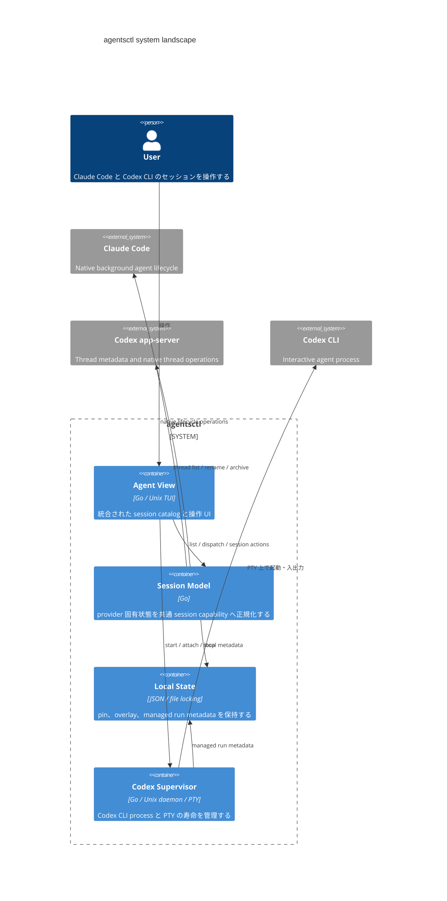

# DesignDoc: agentsctl

**Document Status:** Draft  
**Development Status:** TBD

## Abstract/Summary

agentsctl は、Claude Code のバックグラウンドエージェントと Codex CLI のセッションを、単一の Agent View から操作する Unix TUI である。

提供する共通操作は以下とする。

- List
- Dispatch
- Attach / Detach
- Stop
- Rename
- Archive
- Pin / Unpin

Claude と Codex では、バックグラウンド実行の仕組みが異なる。
そのため、以下の非対称な実行モデルを前提とする。

- **Claude**
  - ネイティブなバックグラウンド実行環境を利用する。
  - セッションの実行主体は Claude 側が保持する。
- **Codex**
  - agentsctl が supervisor と PTY を提供する。
  - supervisor が Codex CLI プロセスを保持する。

各 provider のネイティブなライフサイクルを維持しつつ、Agent View 上では共通の UX を提供する。

### Provider runtime model

| 項目                 | Claude                  | Codex                                               |
| -------------------- | ----------------------- | --------------------------------------------------- |
| バックグラウンド常駐 | Claude のネイティブ機構 | agentsctl supervisor + PTY                          |
| Session catalog      | `claude agents`         | Codex app-server + agentsctl managed run            |
| Dispatch             | `claude --bg`           | supervisor に Codex CLI の起動を依頼                |
| Attach               | `claude attach`         | supervisor が保持する PTY へ接続                    |
| Stop                 | `claude stop`           | supervisor が所有するプロセスを停止                 |
| Rename               | `/rename` via transient attach | Codex app-server                             |
| Archive              | agentsctl-local overlay | Codex app-server、または unbound run のローカル削除 |
| Pin                  | agentsctl-local state   | agentsctl-local state                               |

## Background

Claude Code と Codex CLI は、どちらも継続可能なエージェントセッションを扱える一方で、バックグラウンド実行のライフサイクルやセッションへの再接続までの操作体験に大きな差がある。

agentsctl はこの provider ごとの差異を吸収し、複数セッションを一元的に管理する経路を提供する。

## Goals

- Claude と Codex のセッションを単一の Agent View から一覧・操作できるようにする。
- 以下を provider に依存しない共通操作として提供する。
  - list / dispatch / attach / detach / stop / rename / archive / pin

- Codex でも、TUI の終了後に同じ interactive process へ再接続できるようにする。

## Non-Goals

- Claude / Codex 以外の provider への対応
- Archive したセッションを Agent View から復帰させる操作
- agentsctl 独自の session / transcript 形式を持つこと
- Windows 対応

## Proposed Design

agentsctl は、Claude と Codex を共通の session model として Agent View へ提示する。ただし、実際の lifecycle operation は provider ごとの能力へ委譲する。

agentsctl が補うのは、主に Codex に不足するバックグラウンド実行能力である。

### UX Design

#### Session catalog

Claude と Codex のセッションを統合し、1つの一覧として表示する。

session は作成時刻が新しい順に並べる。Activity や runtime status の変化だけでは並び順を変更しない。これにより、バックグラウンド更新によって閲覧中の行が頻繁に移動することを防ぐ。

##### Grouping

一覧は Pinned group と unpinned group(s) に分ける。

- Pinned session は directory scope に関わらず常に単一の `Pinned` group へ集約する。scope が複数 directory を含む場合、Pinned row には directory path を表示する (directory を跨ぐため group heading だけでは判別できない)。
- Unpinned session は、表示対象の directory がすべて同一なら単一の `Recently created` group、複数 directory を含むなら directory ごとの group に分ける。directory ごとの group では、その heading が directory を示すため row 自体に directory を表示しない。

grouping は表示専用の分割であり、session domain には持ち込まない (`internal/session.Session` に group の概念は存在しない) 。selection は常に `session.Key` で追従するため、grouping の変化 (scope cycling、refresh、pin/unpin) によって選択が失われることはない。

##### Pin / Unpin

Pin 状態は agentsctl が永続化する。

Pin / Unpin 操作は即時に表示へ反映するため、provider の catalog を再取得せず、現在の一覧へ ordering rule を再適用する。

#### Lifecycle

Agent View では Claude と Codex を共通の session model として扱うが、session の実体と実行主体は provider ごとに異なる。

**Claude**

- `claude agents` が提供する native session を session の実体とする。
- native lifecycle state を Agent View の共通 Activity へ変換する。
  - Working
  - Needs input
  - Waiting quota
  - Completed
  - Failed
- background session の実行主体と lifetime は Claude 側が保持する。
- agentsctl の TUI や attach client の lifetime とは独立して存在する。

**Codex**

- Codex app-server が提供する thread を session の実体とする。
- agentsctl が起動した interactive Codex CLI は managed run として別途追跡する。
- managed run が Codex thread と対応付いた後は、両者を1つの session として Agent View に提示する。
- thread とまだ対応付いていない managed run も、session catalog 上で状態を確認できる。
  - 起動中: `Starting`
  - thread に対応付かないまま終了: `Unbound run`

- interactive Codex CLI process と PTY の lifetime は agentsctl supervisor が保持する。
- TUI の lifetime と Codex CLI process の lifetime は分離する。

#### Dispatch / Composer

Composer に入力した prompt を、選択中の provider へバックグラウンド dispatch する。

provider ごとの起動方法は異なるが、Agent View 上では同じ Dispatch 操作として扱う。

**Claude**

- native background dispatch を利用する。
- 起動後の session lifetime は Claude 側へ委譲する。

**Codex**

- Dispatch 前の thread 一覧を記録する。
- agentsctl supervisor が以下を行う。
  1. PTY を作成する。
  2. PTY 上で Codex CLI を起動する。
  3. managed run として process を追跡する。

- TUI 自身は Codex CLI process を直接保持しない。
- 起動後に追加された Codex thread と managed run を対応付け、通常の session として catalog に統合する。

##### Composer directory context

Composer が表示する `<cwd>` と、新規 dispatch が実行される directory context は、選択中 session 自身の CWD に追従する。

- 起動 directory 自体 (`Runtime.CWD`) は directory scope の anchor としてのみ機能し、Composer の表示・dispatch context としては使わない。
- 選択中 session が存在する限り、その CWD が Composer `<cwd>` と dispatch context の両方の source of truth になる。
- 選択可能な session が一つもない場合 (空 catalog) に限り、起動 directory を fallback として使う。これにより空 catalog からでも新規 prompt を dispatch できる。

表示 (`<cwd>`) と実際の dispatch context が異なる値を参照することは絶対に避ける — 同じ導出結果 (`State.ComposerCWD`) を両方が読む。

##### Contextual footer と Help view

Composer 下部には、常時固定の shortcut 一覧ではなく、現在の状態に応じた最小限の footer を表示する。

- `Ctrl+X` の表示 (`stop` / `archive`) は、選択中 session が実際に持つ Action availability から決める。provider ID による再判定は行わない。
- `?` と `Esc` の意味は prompt の空/非空、および help view の表示状態によって変わる。
- Help view は `State` の明示的な UI state (`HelpVisible`) として持つ。terminal decoder は `?` を単なる rune として渡すのみで、"help を開く" という意味付けは `State.Handle` 側で行う。
- Esc の優先順位は次の順で固定する: help visible なら (rename・confirmation の有無に関わらず) help を閉じるだけで prompt/rename/confirmation のいずれにも触れない、help が非表示かつ prompt が非空ならそれを消す、help が非表示かつ prompt が空なら (rename 中ならその rename をキャンセル、confirmation 中ならそれを解除、どちらでもなければ) 終了する。
- footer/help が参照する shortcut の物理 key と label は `keymap.go` の named `Binding` を単一の source of truth とする。footer 表示用に別途 key を持たない。

##### Usage capability

Claude/Codex の 5h・weekly 利用率は、`sessionctl` 側の任意 capability `UsageSource` として表現する。

- `UsageSource` を実装しない provider (Source のみの provider を含む) は、単に usage 行に現れないだけであり、Controller の動作を妨げない。
- 取得は provider ごとに並行して行い、一部 provider の失敗が他方の結果を握りつぶさない (Session catalog の "provider catalog の partial failure" と同じ方針)。
- 巨大な単一 `Provider` interface へ `Usage` を必須 method として追加することはしない。
- usage 取得は Agent View の rendering critical path に置かない。catalog は usage の成功/失敗/速度に関係なく即座に render 可能とし、usage は background で provider ごとに独立して取得・反映する (遅い/hung provider が他 provider の表示や画面の再描画を妨げない)。reload のたびに既知の usage を消すことはせず、新しい結果が届くまで直前の値を表示し続ける。
- ただし直前の値を無期限に表示し続けることはしない。各 provider の usage 行は、直近の成功した取得から一定時間 (5分) 以上経過している場合、または一度も取得できていない場合、percentage を `?%` の unknown placeholder として表示する — 古くなった値をあたかも現在値であるかのように見せない。claude/codex の行自体は常に表示し、取得未完了/stale を理由に行ごと非表示にはしない。この 5分ルールは provider 単位の粗い freshness ゲートであり、window 単位の reset boundary 判定 (下記) とは別の、独立した仕組みである。

**Normalized limit state (#19)**

`session.UsageWindow` は `Available bool` ではなく `State session.UsageLimitState` (`UsageUnknown` | `UsageAvailable` | `UsageExhausted`) を持つ。5h/weekly それぞれ独立にこの3値のいずれかを持ち、#20 のような caller はこの正規化された state だけを見ればよく、provider 固有のエラー文言や `Percent == 100` という慣習を解釈する必要がない。

- `UsageUnknown` (zero value): 一度も取得できていない、provider がその window をそもそも報告しない、reset boundary を跨いだためもう有効ではない、あるいは limit 以外の理由で refresh が失敗した — のいずれか。`Percent`/`Reset` に意味はない。
- `UsageAvailable`: 直近に取得できた実際の利用率。`Reset` (設定されていれば) はまだ未来。
- `UsageExhausted`: provider 自身が該当 window の limit 到達を報告した、有効な state transition。`Percent` は 100 固定 (表示上の convention であり、`Percent` から state を逆算することはしない)。

`Percent == 100` を exhausted の判定根拠にすることはない — 逆に `State` が先に決まり、`Percent` はそれに追従する表示値。同様に `Available == false` (旧モデル) 相当の「不明」を unknown/expired/exhausted のどれとも混同しない。

Agent View の rendering (`usageWindowText`) はこの `State` だけを見て分岐する: `UsageExhausted` → 常に `100%` (red)、`UsageAvailable` → 実際の percentage、`UsageUnknown` → provider 単位の stale placeholder と同じ `?%`。

**Codex**

app-server の `account/rateLimits/read` が返す window (`primary`/`secondary`) は position (どちらのフィールドに入っているか) では 5h/weekly を区別しない。各 window 自身が持つ `windowDurationMins` の値によって分類する。未知/欠落した duration は 5h/weekly のどちらへも推測せず、その window を `UsageUnknown` として扱う (fail closed)。Codex の transport には limit 到達を示す独自の signal がないため、Codex が `UsageExhausted` を報告することはない。

**Claude**

Claude Code には Codex app-server のような on-demand usage 読み取り RPC がないため、agentsctl が所有する専用の interactive Claude session (usage probe) を1つだけ持ち、その session 向け専用設定の `statusLine` から usage snapshot を収集する。

- probe session は agentsctl が生成・所有する session であり、既存のユーザー session を attach/hijack することはない。
- probe session の identity (native session ID) は agentsctl local state に保持し、通常は以後の起動でも同じ session を再利用する。名前や CWD だけを identity の根拠にはしない。ただし Claude Code が特定の session ID を "already in use" として恒久的に reject するケースが実機で確認されている (#19 follow-up) — この場合のみ、同じ `Probe.Usage()` 呼び出し内で session ID を rotate し、最大1回だけ retry する (無限 retry はしない)。rotate 後の ID も同じ probe directory を使い続けるため、後述の workspace trust 状態は rotate によって失われない。
- `probe.json` は複数 agentsctl process から共有されうるため、その load/create・workspace trust 更新・rotation は、`probe.json` 専用の advisory file lock (`probe.json.lock` への `flock`) 配下で1つの read-modify-write transaction として実行する。単に書き込み直前に persisted current を読み直すだけでは、read から write までの間に別 process が割り込む余地が残り不十分 — lock によって「read → 判定 → write」全体を1 transaction として直列化して初めて、reject された ID が既に他 process によって rotate 済みだった場合に新たな ID を発行せずその既存の rotate 結果をそのまま使う、という判定が race なく成立する。retry は rotate が実際に起きたかどうかに関わらず最大1回のまま変わらない。この lock は `Provider.List` 等の read-only アクセスまでは block しない (atomic rename により、読み取りは常に transaction 前後どちらかの完全な状態のみを見る)。
- probe 専用 directory は Claude Code にとって未知の directory であるため、初回起動時のみ workspace trust 確認への応答を行う。以後は Claude Code 自身がその directory を trusted として記憶するため、同じ応答を繰り返さない。この trust 状態は session ID ではなく probe directory に紐づくため、上記の session ID rotation が起きても agentsctl 側の trust 済みフラグは引き継ぎ、trust dialog への応答をやり直すことはない。引き継ぎ元は rotation を呼び出した caller が保持している (refresh 開始時点の) identity のコピーではなく、rotation を実行する時点で probe directory に永続化されている最新の identity である — 同じ refresh attempt の中で trust dialog への応答が完了し `TrustAccepted=true` が永続化された直後に session ID conflict が判明するケースがあり、その場合でも直前に永続化された最新の trust 済み状態を rotation 後の identity へ引き継ぐ。
- probe session は通常の session catalog (Agent View 上の一覧、pin/rename/attach/stop/archive の対象) には現れない。除外は agentsctl が記録している exact な session identity によって provider 境界で行い、CWD だけを条件にはしない。rotate によって使われなくなった旧 session ID も、Claude Code 自身の native catalog からは自動的には消えないため、agentsctl は rotate 済みの旧 ID も (現在の ID と合わせて) 引き続き保持・除外の対象とする — 除外は「現在の1つの ID」ではなく「agentsctl が probe として所有した exact session ID の集合」に対して行う。
- 取得結果は TTL 付きでキャッシュし、Agent View の reload のたびに probe session へ request を送ることはない。cache が stale な場合のみ refresh を行い、複数の呼び出しが同時に発生しても refresh は高々1回に集約する。
- refresh が失敗しても、直前に取得できていた snapshot があればそれを返し、Session catalog や Codex 側の usage を道連れにしない。snapshot が一度も取得できていない場合のみ、この provider の usage を省略する (0% として偽装しない)。

_Limit detection (#19)_ — Claude Code の `statusLine` は `refreshInterval` による定期 tick で再実行されるため、tick が新しいというだけでは「この refresh が送った prompt に対する応答が実際に届いた」ことの証明にならない (installed CLI 2.1.263 で確認: 応答前の tick は `cost.total_api_duration_ms == 0` かつ `rate_limits` 自体が存在しない)。そのため probe は `cost.total_api_duration_ms` が正の値になった tick のみを「この refresh の実応答」として受理する。limit に到達した turn はこの意味での応答を得られないため、probe session 自身の terminal 出力 (以前は破棄していたもの) を limit 到達を示す文言について classify し、この判定だけで Claude provider 境界内に閉じる (統一 rate_limits JSON の解析結果ではなく、terminal 出力の文言に依存する数少ない箇所であり、TUI や provider-neutral domain へは一切漏らさない)。判定は「hit/reached your session limit」「hit/reached your weekly limit」等、具体的な句にのみ一致させ、"limit" という単語単体では判定しない — 同じ CLI バイナリが `context limit` / `token limit` のような無関係な意味でも同じ単語を使うため。5h/weekly いずれか、または両方を独立に `UsageExhausted` として正規化し、影響を受けない側の window は直前の有効な snapshot を保持したまま返す。limit 以外の理由 (timeout・process failure・parse failure) による失敗は、この classify に一致しない限り従来どおりの stale-cache fallback 動作を維持する。検出した exhausted snapshot は (通常の snapshot と同じ `writeUsageSnapshotAtomic` 経由で) probe 自身の `usage.json` にも永続化する — limit 到達時は statusLine collector 自身が書き込む機会を持たないため、ここで明示的に書かないと agentsctl 再起動時に reset 前の percentage へ巻き戻ってしまう。

_Reset boundary (#19)_ — cache 上の snapshot は、それが observe された時点の usage window に対してのみ有効な値である。この判定ルールは Claude provider 内に閉じず、provider-neutral `session.UsageWindow.At(now)` / `session.Usage.At(now)` として一箇所に定義する: window ごとに独立して「現在時刻が、その reading が持つ `Reset` 時刻を過ぎていないか」を確認し、過ぎていれば `UsageAvailable`/`UsageExhausted` を問わず `UsageUnknown` として扱う — reset 前の percentage や exhausted state を、reset を跨いだ新しい window の値として維持することはない。Claude provider は自身の cache を `session.Usage` へ変換する際にこの `At` を一度適用し (`toSessionUsageWindow` 自体は reset 判定を持たない純粋な shape 変換)、Agent View はさらに自分の read/render 時点でも同じ `At` を再適用する (`usageWindowText`) — provider 側の refresh が起きていなくても、State に保持され続けている値が reset boundary を跨いだ後は次の render で `?%` になる。両者が同じ method を呼ぶことで、「Claude provider 内では正規化済みだが Agent View state 内では expiry 済み」というズレを防ぐ。`now` は `time.Now()` を各所に散らすのではなく `Probe.Clock` という単一の injection point を通す (Claude 側の deterministic test のため)。5h と weekly は互いに独立に評価され、片方が reset boundary を跨いでも、もう片方のまだ有効な snapshot には影響しない。

##### Prompt stash

Composer は、1つの共有 prompt stash を持つ。

stash の特徴:

- provider 間で共有する。
- directory scope 間で共有する。
- 選択 session には紐付かない。
- memory 上だけに保持する。
- agentsctl 終了時に破棄する。

Attach 中は terminal input を対象 CLI へ渡すため、Composer / stash の操作とは分離する。

##### Multiline cursor navigation

prompt が複数行になっている間は、`↑` / `↓` は session selection ではなく Composer 内の行移動を優先する。単一行 (空を含む) の間は従来どおり session selection を移動する。

この優先順位判定は `State.Handle` が行い、terminal decoder (`input_unix.go`) は物理 key (`KeyUp` / `KeyDown`) を渡すだけで prompt の内容を意識しない。行移動時の column 保持は一般的な text editor の挙動 (短い行を経由して長い行へ戻ると元の column を維持する) に合わせる。

#### Attach / Detach

Attach すると、Agent View から対象 CLI へ terminal を明け渡す。

Detach すると、session を停止せず Agent View へ戻る。

**Claude**

- `claude attach` を agentsctl が用意した PTY 上で起動する。
- Detach では、まず Claude attach client 自身の detach mechanism を利用する。
- attach client が終了しない場合のみ、agentsctl が所有する attach client の process group を終了する。
- Claude の native background session 自体には signal を送らない。

**Codex**

- managed session では、supervisor が保持する PTY へ Unix socket 越しに接続する。
- PTY の lifetime は attach client と独立させる。
- 以下の場合も Codex CLI の実行を継続する。
  - Detach
  - TUI の終了
  - TUI の再起動

##### External Codex thread

agentsctl がまだ管理していない Codex thread でも、writer が存在しないことを確認できれば Attach できる。

この場合は既存 process へ再接続するのではなく、以下の流れで managed run へ移行する。

1. 既存 thread を resume する。
2. 新しい managed run を起動する。
3. supervisor がその PTY を保持する。
4. Agent View からその PTY へ Attach する。

UI 上では通常の `Attach` として扱う。

#### Session actions

既存 session に対して、Stop / Archive / Rename を提供する。

これらは異なる状態へ作用する独立した操作とし、他の操作を暗黙に伴わない。

##### Stop

Stop は、session に紐づく実行中の process を終了する。

**Claude**

- native stop を利用する。
- agentsctl 側で独自 process lifecycle を持たない。

**Codex**

- supervisor が所有している managed process のみ停止する。
- ownership を証明できない writer は停止しない。

Stop は以下とは独立する。

- Detach
- Archive

##### Archive

Archive は、既存 session を通常の Agent View から除外する。

**Claude**

- agentsctl-local overlay とする。
- 以下には変更を加えない。
  - native session
  - transcript
  - worktree

**Codex thread**

- app-server の native archive を利用する。

**Codex Unbound run**

- Unbound run は Codex thread ではないため、native archive API には送らない。
- 以下を確認したうえで local run state から削除する。
  - terminal state である。
  - thread に未対応付けである。

実行中の session は Archive できない。

Archive が暗黙に Stop を実行することもない。

##### Rename

Rename は、既存 session の表示名を変更する。

**Claude**

- Claude 自身が保持する session を native に rename する。
- 実装上は、agentsctl が transient (使い捨て) な `claude attach <id>` client を起動し、Claude 自身の `/rename` slash command を送信したうえで、その attach client だけを detach する。
- session ID・sessionId・pid・実行中 process のいずれも変化しない。working session に対して行っても実行を中断しない。
- rename 成否は、attach client 自身の終了確認ではなく `claude agents --json --all` による native catalog の再取得で判定する。attach client の detach 自体が失敗しても、catalog が新しい名前を確認できていれば rename は成功として扱う。
- native catalog confirmation (rename の完了判定) と attach client の cleanup (lifecycle の後始末) は並行して行う。cleanup は rename の成否そのものには関与しないため、user-visible な完了を cleanup の完了で遅延させない。ただし、agentsctl 自身のプロセス寿命内で attach client を残さないため、呼び出しは cleanup の完了も待ち合わせたうえで返る。
- `claude --bg --resume <id> --name <name>` は使用しない。別 session (別 ID) を生成することが確認されているため。
- 過去バージョンの agentsctl-local overlay (`state.Data.ClaudeNames`) は、native catalog が名前を持たない session に対してのみ表示上のフォールバックとして残る。native rename が成功した session については、そのタイミングで overlay を削除する。

**Codex**

- app-server の native rename を利用する。

#### Directory scope

Agent View は、agentsctl を起動した directory (target directory) を基準に3つの scope を持つ。

| Scope                            | 対象                                                                     |
| --------------------------------- | ------------------------------------------------------------------------ |
| `same directory`                  | target directory と CWD が一致する session                               |
| `descendants + worktree directories` | target directory 自体とその descendant、および同じ repository に属する worktree directory (とそれぞれの descendant) |
| `all directories`                 | 全 session                                                               |

scope は以下の順で切り替える。

```text
same directory -> descendants + worktree directories -> all directories -> same directory
```

selection identity (`session.Key`) と scope cycling は独立している。scope を切り替えても選択中 session が引き続き catalog に存在すれば選択は維持される。

##### Worktree discovery

`descendants + worktree directories` scope が必要とする worktree directory の一覧は、`git worktree list --porcelain` を用いた git/filesystem I/O で取得する。

この discovery は `internal/session` の pure な `Filter` の外側 (`internal/workspace`) に置き、以下の dependency direction を守る。

```text
git/filesystem discovery (internal/workspace)
        -> normalized scope roots / worktree directories
        -> pure session filtering (internal/session.Filter)
```

`internal/session.Scope` は discovery 済みの worktree directory を `WorktreeDirectories` としてそのまま受け取るだけであり、git や filesystem を一切呼び出さない。worktree discovery が失敗する場合 (git repository でない、`git` が利用不可など) は、target directory 自身の descendant のみへ安全にフォールバックする — scope 全体を失敗させない。

##### Path matching

`descendants + worktree directories` は path boundary を考慮する。

例えば以下の場合:

```text
/project
/project/src
/project-other
```

`/project` を基準とした scope に含むのは以下。

```text
/project
/project/src
```

`/project-other` は含めない。

単純な文字列 prefix matching は使用しない。この判定は `/project` (target directory) だけでなく、各 worktree directory を root とした場合にも同様に適用する。

##### Symlink

基準 directory は logical path として扱う。

symlink は解決しない。

##### Persistence

Directory scope は表示状態であり、永続化しない。

#### Feedback and confirmation

operation の結果が UI の変化から明確に分かる場合、追加 notification は表示しない。

例:

- session が追加される
- editor が閉じる
- pin によって行が移動する
- archive confirmation が消える

##### Global errors

Composer 上部の notification area は error 用とする。

例:

- 操作が拒否された
- provider が利用できない
- capability がない
- 入力値が不正

##### Row notice

特定 session にだけ関係する notice は、その session row に表示する。

Archive confirmation は row notice として扱う。

確認状態は session identity に紐付けるため、以下をまたいでも同じ session に追従する。

- Refresh
- Pin / Unpin
- Reordering

##### Width priority

terminal width が不足する場合、表示優先度を設ける。

優先する情報:

1. Provider
2. CWD
3. Row notice
4. Title

session の識別に必要な情報を優先し、補助情報から省略する。

### Implementation Design

#### Design principles

実装全体では、以下を基本原則とする。

1. **Native state is canonical**
   - provider が所有する session state を source of truth とする。
2. **Local state is supplemental**
   - agentsctl 固有の metadata のみ保持する。
3. **Provider differences stay explicit**
   - Claude と Codex の runtime model の差を無理に同一化しない。
4. **Process operations fail closed**
   - ownership や identity を証明できない process には介入しない。
5. **TUI lifetime and agent lifetime are separated**
   - TUI の終了が background agent の終了を意味しない。

#### Landscape



この図は概念上の責務境界を示す。

Go package の構成そのものは規定しない。

#### Common session model

Agent View は provider 固有 object を直接扱わず、共通の session model へ正規化する。

主な情報は以下。

- Provider
- Native session identifier
- Display name
- Summary
- CWD
- Created time
- Updated time
- Activity
- Runtime ownership
- Archive state
- Pin state
- Capabilities

Capabilities には以下を含む。

- Attach
- Stop
- Rename
- Archive
- Unarchive
- Respawn

UI は provider 名だけで操作可否を判断せず、各 session が持つ capability を基準に action を提供する。

#### Native state and local overlays

provider の native state を canonical state とする。

agentsctl は native session record や transcript を複製せず、agentsctl 固有の metadata のみ local state に保持する。

##### Local state

主に以下を保持する。

- Pin
- Claude Archive overlay
- Codex managed run metadata

Claude session の表示名 (`ClaudeNames`) は、native rename 導入以前の overlay が migration compatibility として残るのみで、新規 rename の保存先ではない。

##### Overlay

overlay は native result の取得後に適用する。

用途:

- provider に該当する native API がない場合
- native state を変更すべきでない場合
- agentsctl 固有の表示状態を持つ場合

overlay を native state の代替 source of truth としては扱わない。

##### Persistence

local state は複数 process から利用される。

そのため、更新時は以下を保証する。

- file lock
- read-modify-write の排他
- atomic な置き換え
- partial write を通常状態として公開しない

#### Codex supervisor

Codex CLI の interactive process と PTY は、Agent View の TUI process とは別の supervisor が所有する。

##### Responsibilities

supervisor は以下を担当する。

- managed run の起動
- PTY の保持
- Attach client との入出力
- terminal resize
- Detach
- managed process の Stop
- managed run metadata の更新

##### Lifetime

TUI が終了しても、supervisor と Codex CLI が生存していれば PTY は維持する。

supervisor が終了した場合、既存 PTY は復元できない。

その場合は process を推測して再利用せず、既存 managed run を stale として扱う。

#### Supervisor IPC

TUI と supervisor の通信には Unix socket を利用する。

socket 上では、length-prefixed frame protocol を使用する。

##### Control frames

- Request
- Response
- Exit
- Failure

##### PTY frames

- Input
- Output
- Resize
- Detach

control request / response と PTY stream を、同じ framing mechanism で扱う。

##### Compatibility

supervisor とは以下の compatibility を確認する。

- Protocol version
- Build generation

互換性を確認できない daemon を、そのまま再利用しない。

#### Process ownership and identity

PID 単独では process identity として扱わない。

PID は再利用される可能性があるため、以下を組み合わせる。

- PID
- Process start time
- UID

process に介入する直前に、OS から identity を再取得する。

記録値と一致しない場合は操作を拒否する。

##### Fail-closed cases

以下の場合も推測しない。

- process が見つからない
- identity を確認できない
- ownership が一致しない
- 複数 candidate が存在する

#### Codex run-to-thread binding

Codex の managed run は、起動直後には app-server thread ID を持たない。

そのため、Dispatch 前の thread 一覧を baseline として保持する。

起動後、以下から candidate を絞る。

- baseline に存在しなかった thread
- CWD
- writer ownership

candidate が1つの場合のみ binding する。

```text
managed run -> Codex thread
```

candidate が以下の場合は binding しない。

- 0件
- 2件以上

session ID を推測して割り当てることはしない。

#### PTY attach and redraw

Codex Attach では、過去の PTY output を replay しない。

新しい attach client は接続後の output のみ受け取るため、画面復元は Codex CLI 自身の redraw に依存する。

##### Same-size reattach

再 Attach 時に terminal size が前回と同じ場合でも、確実に redraw させる必要がある。

そのため、PTY size を以下の順で変更する。

1. 一時的な別 size
2. 実 terminal size

これにより actual resize event を発生させ、Codex 自身の redraw lifecycle を利用する。

この処理は表示だけに関与し、conversation state には関与しない。

#### Concurrency and backpressure

##### Catalog loading

Claude と Codex の session list は provider ごとに並行取得する。

目的は latency を加算させないこと。

```text
Claude: ──────────┐
                  ├─ merge
Codex:  ───────┐  │
               └──┘
```

1回の refresh は、provider ごとの取得完了を待ってから統合する。

partial result を逐次描画する方式にはしない。

provider が利用できない場合は、その error を provider 単位で保持する。

他方の provider から取得できた session は破棄しない。

##### PTY output

supervisor は PTY output を attach subscriber へ配信する。

subscriber が遅い場合でも、PTY 自体の read loop を停止させない。

session process の進行を UI client の描画速度に依存させない。

#### OS boundaries

以下には OS 固有機能を利用する。

- process start time の取得
- Unix socket peer identity の取得
- process group 操作
- PTY 操作

安全性要件を維持できない platform では、推測による fallback を実装しない。

MVP の対象 OS は以下。

- macOS
- Linux

## Alternatives Considered

### Codex CLI を TUI の子 process として保持する

**不採用。**

TUI の終了とともに interactive process への接続経路を失い、TUI 再起動後に同じ PTY へ戻れない。

そのため、Codex process と PTY の寿命を TUI から分離する supervisor を採用する。

### PID のみで process を識別する

**不採用。**

PID reuse により、無関係な process を操作する可能性がある。

以下を組み合わせて identity を確認する。

- PID
- Start time
- UID

### Codex thread を CWD や時刻だけで推測する

**不採用。**

誤った thread へ以下の capability を与える可能性がある。

- Attach
- Stop

binding を一意に証明できない場合は、unbound のまま扱う。

### 単発の redraw signal を送る

**不採用。**

underlying PTY size に変化がない場合、CLI 側が redraw 不要と判断できる。

実際の PTY size を一度変更して元へ戻す方式を採用する。

### `claude --bg --resume <id> --name <name>` を Rename に使う

**不採用。**

resume 時に `--name` を指定する方式は、既存 background session を in-place で改名する操作ではなく、別 session (別 ID) を生成する。session state・active/stopped を問わず、また省略形でなく完全な session ID を指定しても同様に fork する。

代わりに、transient な `claude attach <id>` client を起動して Claude 自身の `/rename` slash command を実行し、既存 session を in-place で改名する方式を採用する (session ID・sessionId・pid が変化しないことを実機で確認済み)。

### Claude transcript を直接編集する

**不採用。**

以下の問題がある。

- provider が所有する内部形式への依存
- native daemon との write conflict
- undocumented format への coupling

agentsctl は Claude transcript を書き換えない。

### Archive と Stop を同じ lifecycle action とする

**不採用。**

両者の意図が異なる。

- Stop: process を終了する
- Archive: Agent View から除外する

active session を整理する場合は、先に明示的に Stop する。

Archive は inactive session の visibility を変更する操作として扱う。

## Open Questions

現時点で未解決の論点はない。
