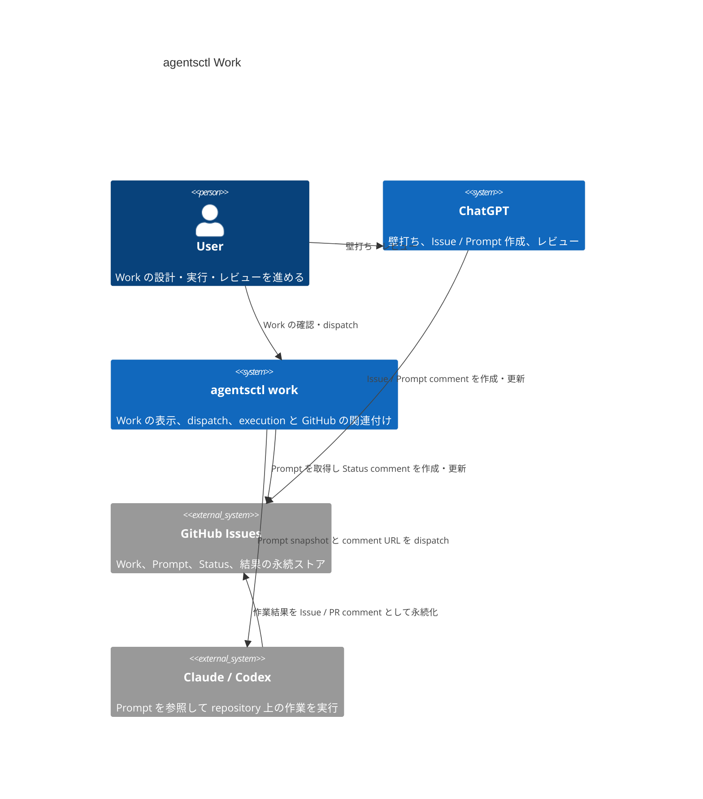

# DesignDoc: Work

**Document Status:** Draft  
**Development Status:** TBD

## Abstract/Summary

Work は、GitHub Issue を永続的な Work の記録として利用し、ChatGPT での壁打ち・Prompt 作成から Claude / Codex での実行、結果確認、レビュー、修正までを継続的に追跡する `agentsctl work` の設計である。

agentsctl は GitHub Issue 上の Prompt comment と Status comment を durable source of truth として扱う。provider runtime の現在状態は GitHub だけでは確定できないため、Status comment に記録した execution identity と provider 側の execution state を照合して Work state を再構成する。

manual dispatch と auto dispatch は同じ dispatch pipeline を利用する。1 Issue 最大1 active dispatch は単一 host 内では保証し、複数 host 間では GitHub comment に atomic claim が存在しない制約上 best-effort とする。

### Core Model

| Concept | Design |
| --- | --- |
| Work identity | Repository + GitHub Issue |
| Durable source of truth | GitHub Issue / Prompt comment / Status comment |
| Prompt | `agentsctl-work` metadata を持つ Prompt comment |
| Execution record | 1 dispatch につき1つの Status comment |
| Execution unit | provider session ではなく dispatch した turn / execution |
| Concurrency | 1 Issue 最大1 active dispatch。単一 host では保証、複数 host は best-effort |
| Repository | Work 作成時に確定 |
| Worktree | agentsctl では管理せず、Prompt / coding agent に委ねる |
| Manual execution | `/dispatch` |
| Work creation + execution | `/work-dispatch` |
| Repository auto | `/auto` |
| Issue auto | `/work-auto` で repository policy を override |
| Provider availability | `available` / `unavailable` / `unknown` |
| Automatic retry | strict な usage-limit interruption の continuation のみ |

### Related Documents

- [DesignDoc: agentsctl](DesignDoc.md)

## Background

agentsctl と third-score のように複数 repository の開発を並行し、さらに1つの repository 内でも ChatGPT、Claude、Codex の複数 session を行き来すると、現在どの Work が誰の処理を待っているかを把握しづらくなる。

ChatGPT で壁打ちして作成した Prompt を coding agent へ渡し、完了後に ChatGPT でレビューする現在の loop では、Prompt の内容や実行結果が chat session と terminal session に分散する。Prompt の copy / paste を自動化しても、どの repository、Issue、ChatGPT session、coding-agent session が同じ Work に属するかを復元できなければ、並行作業時の認知負荷は残る。

Work は、GitHub Issue に durable な handoff と execution record を残し、agentsctl がそれを現在の session catalog と provider execution state に結び付けて表示・dispatch できる状態を提供する。

## Goals

- 複数 repository と複数 agent session を並行していても、各 Work の現在状態と次に必要な行動を復元できるようにする。
- ChatGPT が作成した Prompt と coding agent の実行結果を、GitHub Issue 上で追跡可能にする。
- manual dispatch と auto dispatch を同じ Work model と dispatch pipeline で扱えるようにする。
- agentsctl の local state を失っても、GitHub Issue と comments から durable な Work execution history を復元できるようにする。
- provider 固有の session lifecycle と execution lifecycle を分離し、dispatch した execution を provider 固有の source から追跡できるようにする。
- 単一 host 内で、Work 単位では1 Issue 最大1 active dispatch を保証する。

## Lower-Priority Goals

- repository への Prompt comment 投稿を検知し、自動で dispatch する。
- provider の usage limit により中断した Work を、利用可能な別 provider へ自動で引き継ぐ。
- GitHub Issue 以外の Work store へ拡張できる境界を維持する。

## Non-Goals

- agentsctl が worktree を作成・選択・管理すること。
- ordinary failed execution を自動 retry すること。
- 同一 Issue で複数 dispatch を並列実行すること。
- 複数 host 間で distributed lock を構築し、single-active-dispatch を強く保証すること。
- coding agent が repository 内で行う実装手順や branch / worktree strategy を agentsctl が決定すること。
- coding agent の最終出力を agentsctl が要約・再解釈すること。
- provider session の Activity を Work execution state と同一視すること。

## Proposed Design

Work は GitHub Issue を中心に、Prompt、dispatch、Status、review を直列に積み重ねる。agentsctl は GitHub 上の protocol comment と provider execution を結び付け、利用者が Work の現在状態を復元し、必要な handoff を実行できるようにする。

### UX Design

#### Work lifecycle

Work の基本 lifecycle は以下とする。

1. ChatGPT で壁打ち・事前調査を行う。
2. GitHub Issue を作成する。
3. ChatGPT が coding agent 向け Prompt を作成し、Issue comment として投稿する。
4. agentsctl で Work を作成し、Prompt を dispatch する。
5. coding agent が Prompt を参照して作業し、成果を push または Issue / PR comment として永続化する。
6. dispatch した execution の終了を agentsctl が検知し、Status comment を更新する。
7. ChatGPT で結果をレビューする。
8. 修正が必要な場合は新しい Prompt comment を投稿し、同じ loop を繰り返す。

dispatch 前の Prompt comment は修正可能とする。ChatGPT 側の `agentsctl-work` skill は、同じ Issue に未着手 Prompt がある場合、新しい Prompt を追加するのではなく原則としてその comment を更新する。

Prompt に対応する Status comment が作成された後は、その Prompt を dispatch 済みの execution artifact とみなす。通常の修正は既存 Prompt を書き換えず、新しい Prompt comment として追加する。dispatch 済み Prompt の変更を要求された場合は、execution history が変わるため ChatGPT 側で確認を取る。

#### Work creation

Work 作成時は、選択中の ChatGPT session と repository + Issue を関連付ける。

```text
/work #<issue-number> [name]
```

`name` は省略可能とし、Tab で選択中 ChatGPT session の name を placeholder として利用できるようにする。

Work 作成時に確定する filesystem context は repository までとする。worktree の作成・選択は Prompt の指示と coding agent の判断へ委ねる。

Work 作成直後に続けて dispatch する操作は shorthand として提供する。

```text
/work-dispatch #<issue-number> [name]
```

`/work-dispatch` は `/work` と `/dispatch` と同じ pipeline を順に実行し、独自の dispatch semantics は持たない。

#### Dispatch

`/dispatch` は Work の Issue から protocol-valid な Prompt comment を取得し、Status comment が存在しない eligible Prompt を dispatch 対象とする。

未着手 Prompt が1件の場合は、その Prompt をそのまま使用する。複数ある場合は、投稿時刻の降順で selection UI を表示し、利用者が dispatch 対象を選択する。

auto dispatch は trusted Prompt だけを対象とする。manual dispatch で trusted-author rule を満たさない Prompt を選択する場合は、明示的な user action と確認を必要とする。

dispatch 時には Prompt comment URL だけを provider に渡さず、claim 時点で検証した Prompt body snapshot と repository identity を instruction に含める。Status comment の `prompt-digest` はこの snapshot に対応し、dispatch 後の Prompt 編集によって実際に実行した内容が変化しないようにする。comment URL は provenance と参照用に併記する。

同一 Issue に active dispatch が存在する間は、新しい dispatch を開始しない。新しい Prompt comment が追加されても pending のまま保持し、現在の dispatch が終了した後に次の dispatch 対象となる。

#### Work status and feedback

1回の dispatch は1つの Status comment を持つ。

dispatch の claim を開始した時点で Status comment を作成し、provider execution を開始するまでは `starting`、execution 開始後は `running` とする。

```text
agentsctl running...
```

execution が終了したら、同じ Status comment を更新する。正常終了時は provider execution の status と final output を人間がそのまま読める形で表示する。

```text
agentsctl worked.

Status: Completed

Result:
<final-output>
```

`Result` は dispatch した execution の最後の user-visible assistant response とする。tool output や provider が生成した要約は含めず、agentsctl は内容を要約・再解釈しない。

terminal state は以下を用いる。

- `completed`: execution が正常終了した。
- `failed`: ordinary failure。自動 retry しない。
- `interrupted`: strict に判定できた provider usage limit による中断。
- `stopped`: user / agentsctl が明示的に stop / interrupt した。
- `abandoned`: runtime loss や observation failure により execution の結果を確定できない。
- `superseded`: dispatch claim の競合に負け、provider を起動しなかった。

`interrupted`、`failed`、`stopped` では必要に応じて diagnostic や確定済み partial output を別 section に表示する。`Result` は `completed` の final output に限定する。

permission / approval 等で provider が user input を待っている状態は terminal state ではなく `running` のままとする。

#### Work listing and scope

`agentsctl work` の一覧 scope は既存 Agent View と同じ切り替えを利用する。

```text
current directory
→ current directory + descendants + worktrees
→ all
```

Work は repository + Issue を identity とし、その下に関連する ChatGPT / Claude / Codex session と execution を関連付ける。

repository-wide auto が有効な場合は、Issue の取得と Issue number を含む ChatGPT session の grouping を利用して Work を自動構成できるようにする。明示的な Work association がある場合は、それを session name からの推定より優先する。

#### Automatic dispatch

自動化は manual `/dispatch` と別の execution path を作らず、同じ dispatch pipeline を trigger から起動する。

repository 単位の auto policy は、選択中 session の folder から repository を確定し、`/auto` で切り替える。

Issue 単位では `/work-auto` によって repository policy を override する。Issue policy は conceptual に以下の3状態を持つ。

- inherit
- on
- off

MVP の Prompt observation は repository 単位の Issue comment polling を利用する。`since` と ETag を利用して incremental に取得し、定期的な Issue 単位の full reconcile で missed event や restart を回復する。repository-wide comment 一覧には Pull Request の conversation comment も含まれるため、Work Issue と protocol marker で filter する。

Notifications / Events API は Prompt 投稿を確実に観測する source として利用せず、Webhook は public listener / server component が必要になるため MVP の local CLI/TUI では採用しない。

新しい trusted Prompt comment の投稿を一意に検知できた場合は、その Prompt を直接 dispatch 対象として扱う。agentsctl 起動前から複数の未着手 Prompt が存在し、一意に対象を決められない場合は自動で選択しない。

#### Trusted Prompt

auto dispatch は以下を満たす Prompt だけを trusted とする。

- protocol-valid な Prompt comment である。
- comment author が通常 user であり、allowlist された login である。default は agentsctl で認証している本人。
- repository permission が write 以上である。
- comment が編集されている場合、editor についても同じ条件を満たす。
- author / permission / editor を確認できない場合は fail-closed とする。

`author_association` は trust の根拠にしない。ChatGPT や coding agent が GitHub 上では同じ user 名義で投稿する場合があるため、投稿経路そのものを trust signal として扱わない。

Status comment と continuation Prompt も同じ protocol validation / trust rule を通す。

#### Usage limit failover

automatic continuation は provider の strict な usage-limit interruption の場合だけ行う。ordinary `failed`、`stopped`、`abandoned` は対象外とする。

usage limit を検知した場合は、まず現在の Status comment を `interrupted` として確定して active slot を解放する。その後、元 Prompt と直前の Status comment を参照する continuation Prompt を生成する。

continuation Prompt は新しい設計判断を agentsctl が行うものではなく、既存 Work の続きから安全に再開するための定型 handoff とする。

```md
<original Prompt URL> の作業は <previous Status URL> で usage-limit interruption になりました。
この repository と Issue の現在状態、既存 branch / worktree、uncommitted/staged changes、既に完了した作業を確認し、重複してやり直さず安全に続行してください。
前 provider の local-only state や実行中 process は引き継がれていると仮定しないでください。

<!--
agentsctl-work
type: prompt
version: 1
continues: <previous-status-comment-id>
-->
```

continuation の自動 dispatch は以下をすべて満たす場合だけ行う。

```text
execution is terminal usage-limit interruption
AND interrupted Status is durably persisted
AND effective auto policy is on
AND exactly one canonical trusted continuation Prompt exists
AND Issue has no active dispatch
AND target provider differs from the interrupted provider
AND target provider availability is available
AND target provider has not been automatically attempted in the chain
AND the common dispatch gate is acquired and re-check succeeds
```

provider availability は `available` / `unavailable` / `unknown` の3値とし、`available` の場合だけ automatic dispatch する。`unknown` を optimistic に `available` と扱わない。

2-provider MVP では continuation chain 内で Claude / Codex をそれぞれ最大1回だけ automatic attempt する。Claude → Codex → Claude の自動往復は行わない。

同じ interrupted Status を参照する trusted continuation Prompt が複数存在する場合、comment ID が最小のものを canonical とする。non-canonical な duplicate continuation Prompt は auto / manual の双方で dispatch-ineligible とする。

利用可能な provider がない場合は continuation Prompt を未着手のまま保持する。`waiting` は durable state として追加せず、continuation chain 上の current terminal Status と pending continuation Prompt から導出する。

```text
current chain Status == interrupted
AND canonical trusted continuation Prompt exists
AND continuation Prompt has no Status
AND Issue has no active dispatch
```

manual dispatch で開始した Work でも、effective auto policy が on なら usage-limit continuation を自動実行できる。off の場合は continuation Prompt の作成まで行い、dispatch は user action を待つ。

### Implementation Design

#### Landscape



GitHub Issues は Work の durable source of truth を担う。一方、active execution の liveness と completion は provider runtime から読み取る必要がある。agentsctl の local state は UI / policy / runtime association を補助するが、Prompt 本文や durable execution result を local store のみに保持しない。

#### Work model

Work の identity は repository + GitHub Issue とする。

```text
Work
├── Repository
├── Issue
├── ChatGPT session(s)
├── Prompt comment(s)
├── Status comment(s)
├── Dispatch / execution(s)
└── Claude / Codex session(s)
```

repository は Work 作成時に確定する。worktree は Work model に含めず、各 Prompt と coding agent の実行方針に委ねる。

Issue の open / closed state と Work execution state は同一視しない。Work execution state は GitHub protocol comments と provider execution state の reconcile から導出する。

#### GitHub Work protocol

GitHub Issue では通常の人間向け discussion と Work protocol comment が共存する。protocol comment は本文末尾の HTML comment 内に `agentsctl-work` marker を置き、agentsctl が本文の自然言語から protocol type を推測しないようにする。

marker が malformed、重複、unsupported version、unknown type の場合は protocol-invalid とする。未知 field は version policy の範囲で扱い、security / execution semantics を安全に判断できない場合は fail-closed とする。

##### Prompt comment

Prompt comment は coding agent に渡す実行指示を本文として持つ。

```md
<Prompt body>

<!--
agentsctl-work
type: prompt
version: 1
-->
```

continuation Prompt は optional な `continues` relation を持つ。

```md
<!--
agentsctl-work
type: prompt
version: 1
continues: <interrupted-status-comment-id>
-->
```

`continues` は同一 Issue の trusted な `interrupted` Status だけを参照できる。

未着手 Prompt は、その comment を参照する Status comment が存在しない eligible Prompt とする。duplicate continuation の non-canonical Prompt は Status が存在しなくても eligible ではない。

##### Status comment

Status comment は1回の dispatch を表し、Prompt と execution identity を hidden metadata で記録する。

```md
agentsctl running...

<!--
agentsctl-work
type: status
version: 1
prompt: <prompt-comment-id>
dispatch: <dispatch-id>
host: <host-id>
provider: <provider>
session: <canonical-session-id>
turn: <provider-turn-id>
state: running
prompt-digest: <digest>
-->
```

`session` と `turn` は provider identity を取得できた段階で追記する。`turn` は optional とし、Codex では `turnId`、Claude では transcript の dispatch turn `promptId` を利用する。Claude の `session` は短縮 ID ではなく UUID の `sessionId` を記録する。

`dispatch` は Work execution identity を兼ねる。別の `execution-id` は追加しない。

state vocabulary は以下とする。

- `starting`
- `running`
- `completed`
- `failed`
- `interrupted`
- `stopped`
- `abandoned`
- `superseded`

Prompt と Status の関係、continuation relation、execution state は comment ordering に依存させない。

#### Prompt observation

repository 単位の Issue comments API を `since` と ETag 付きで polling し、新規または更新された protocol comment を検知する。`since` の boundary は inclusive として重複取得を許容し、comment ID / updated timestamp で idempotent に処理する。

polling は low-latency trigger であり、source of truth は常に Issue の current comments とする。restart や missed observation に備え、tracked Work は定期的に Issue 単位の full reconcile を行う。

comment edit も observation 対象になる。dispatch claim 後は Status の `prompt-digest` と snapshot が実行内容を固定するため、後続 edit によって既存 execution の意味を変更しない。

#### Dispatch pipeline

manual / automatic trigger は、いずれも同じ dispatch pipeline を利用する。

```text
Trigger
  ↓
Resolve Work
  ↓
Read / validate Prompt
  ↓
Capture Prompt snapshot + digest
  ↓
Select eligible Prompt
  ↓
Acquire local dispatch gate
  ↓
Create Status(starting)
  ↓
Re-read Issue and elect claim winner
  ↓
Start provider execution
  ↓
Persist canonical session / turn identity
  ↓
Observe execution completion
  ↓
Update Status
```

Status comment の作成は dispatch claim を GitHub 上に残す boundary だが、GitHub 自体には atomic claim primitive がない。

##### Dispatch invariant

同一 process 内では mutex、同一 host 内では file lock を利用して dispatch gate を直列化する。

Status comment を作成した後に Issue を再読込し、同じ Issue の active Status のうち最も古い claim を winner とする。loser は provider を起動せず `superseded` に更新する。

この手順により単一 host 内の二重 dispatch は防止する。複数 host は GitHub comment create / update に compare-and-swap がないため strong guarantee を提供せず、post-create reconcile による best-effort convergence とする。

##### Prompt selection

manual dispatch では以下の規則を用いる。

- eligible Prompt が0件: dispatch しない。
- eligible Prompt が1件: その Prompt を使用する。
- eligible Prompt が複数件: 投稿日時の降順で selection UI を表示する。

auto dispatch では、新規投稿 event が一意の trusted eligible Prompt を指す場合だけその Prompt を使用する。既存 Prompt が複数あり一意に選べない場合は auto dispatch しない。

##### Provider execution observation

provider session status、provider execution status、Work dispatch status は別の層として扱う。

```text
Provider session status
  ↓ wake-up trigger
Provider execution status
  ↓ authoritative execution result
Work dispatch status
```

session の Idle / done や process の生存だけから Work completion を決めない。

###### Codex

Codex は app-server API を authoritative source とする。

- dispatch 時に `turn/start` の `turnId` を取得する。
- `clientUserMessageId` に Work の `dispatch` ID を設定し、provider 側にも execution relation を永続化する。
- `thread/turns/list` の対象 turn の `status` / `error` から completion を判定する。
- final output は対象 turn の最後の `agentMessage` のうち `phase=final_answer` の text とする。
- restart 後に local `turnId` を失っても、persist された client ID から dispatch turn を再発見できる。

既存の Codex session Observer は Work completion の source にはせず、execution state を読み直す trigger として利用する。

###### Claude

Claude の public surface では session 単位の status までしか得られないため、turn 単位の observation は local transcript JSONL を利用する。

- canonical session identity は UUID の `sessionId` とする。
- dispatch turn は transcript の human prompt / `promptId` で識別する。
- `claude agents --json --all` の session state は execution state を読み直す trigger として利用する。
- final output は dispatch turn 内の最後の assistant API message の user-visible text とする。
- `state.json` の `output.result` は provider が生成した要約であり Result には利用しない。

transcript JSONL とその quota field は undocumented implementation detail であるため、version guard と fail-closed を必須とする。期待した schema を読めない場合に推測で `completed` や `interrupted` へ分類しない。

Claude `--bg` は session ID を事前固定できないため、provider start から canonical session ID の記録までに agentsctl が停止した場合は一意に復旧できないことがある。この場合は重複 dispatch を避け、確定不能なら `abandoned` に収束させる。

##### Completion mapping

provider execution は以下の Work category へ mapping する。

| Work state | Meaning |
| --- | --- |
| `completed` | dispatch execution が正常終了した |
| `failed` | usage limit 以外の terminal failure |
| `interrupted` | strict classifier が provider usage limit と判定した |
| `stopped` | explicit user / agentsctl stop |
| `abandoned` | runtime / transcript / protocol から結果を確定できない |

provider session status は mapping の入力ではなく、provider-specific ExecutionReader を起動する trigger とする。

#### Provider availability

usage-limit failover の target selection では provider availability を次の3値で表す。

- `available`: 通常の Work execution を開始できると確認できる。
- `unavailable`: 明示的に未設定、未認証、または quota block と確認できる。
- `unknown`: transport / daemon / schema / freshness 等により現在の availability を確認できない。

automatic dispatch は `available` の場合だけ行う。

##### Claude availability

Claude は以下を組み合わせて判定する。

- binary / provider configuration。
- `claude auth status --json`。
- daemon / catalog reachability。
- fresh な usage snapshot。

usage snapshot probe は real API response を伴い quota を少量消費するため pure read ではない。既存 cache を優先し、failover ごとに強制 refresh しない。snapshot absent / stale / schema unknown / probe failure は `unknown` とする。

Claude execution を `interrupted` に分類する primary signal は transcript の structured `quotaLimits` とする。

```text
isApiErrorMessage == true
AND error == "rate_limit"
AND quotaLimits.status == "rejected"
AND quotaLimits.rateLimitType is allowlisted
```

MVP は fixture / observed data で確認した subscription usage-window value だけを allowlist する。structured quota field が absent / unknown の場合は fail-closed とし、localized text や text-derived `UsageExhausted` だけを automatic failover の根拠にしない。

reset time は execution entry の `quotaLimits.resetsAt` を優先し、account / waiting UX では対応する usage snapshot の `resets_at` を利用する。

##### Codex availability

Codex は app-server の `account/read` と `account/rateLimits/read` を利用する。

`ordinaryUsageAllowed` を authoritative な3値として扱う。

- `true`: `available`
- `false`: `unavailable`
- `null` / field absent / RPC failure: `unknown`

percentage だけから availability を推測しない。`rateLimitReachedType` と reset windows は reason / next-check hint として保持する。

Codex execution は `Turn.status=failed` かつ `Turn.error.codexErrorInfo=usageLimitExceeded` の場合だけ `interrupted` とする。`rateLimitExceeded`、`serverOverloaded`、`sessionBudgetExceeded`、`responseTooManyFailedAttempts` は `failed` とする。

tool / reviewer 内の usage-limit-looking text だけでは main execution を `interrupted` に変更しない。

#### Continuation chain

continuation relation は次の link から復元する。

```text
Continuation Prompt.continues
  → Interrupted Status
  → Status.prompt
  → Previous Prompt
```

別の root / attempt metadata は追加しない。chain 内の Status provider 集合を automatic attempt 済み provider として扱う。

同一 interrupted Status に複数 continuation Prompt が生じた場合は comment ID が最小の trusted Prompt を canonical とし、残りは protocol warning として dispatch-ineligible にする。

provider failover 後の target execution が ordinary failure した場合はそこで manual action required とする。target provider も usage limit になった場合は continuation relation を durable に残せるが、2-provider MVP では両 provider が chain 内で attempt 済みになるため自動 dispatch しない。

#### State recovery

agentsctl 起動時は GitHub Issue と protocol comments から、少なくとも以下を再構成する。

- Work に属する Prompt comments。
- continuation relation と canonical continuation Prompt。
- 各 Prompt の dispatch 有無。
- active / completed / failed / interrupted / stopped / abandoned / superseded execution。
- provider、canonical session identity、optional turn identity、dispatch ID。
- 未着手 eligible Prompt。
- continuation chain と automatic attempt 済み provider。
- derived waiting state。

GitHub の `running` / `starting` だけでは execution が現在も active か判断しない。Status の provider/session/turn identity を使い、ExecutionReader と照合して reconcile する。

代表的な recovery は以下とする。

- execution が provider 側で active: `running` を維持する。
- execution が provider 側で terminal: final state / output を読み、Status を更新する。
- provider runtime が見つからず terminal result も確定できない: `abandoned`。
- Status `starting` で provider identity が不完全: provider 固有の rediscovery を試み、確定できなければ重複 dispatch を避けて `abandoned`。
- continuation Prompt 作成済み・未 dispatch: その Prompt を再利用し、重複作成しない。
- availability `unknown`: waiting のまま自動 dispatch しない。

provider execution の read は restart 後にも冪等に行えることを前提とする。Codex は app-server API、Claude は transcript JSONL を利用する。

local-only な auto policy、明示的 session association、表示 state の永続化方法は implementation design で確定する。

### Implementation Boundaries

後続実装では、少なくとも以下の責務を分離する。

- **GitHub Work protocol / store**: Prompt / Status parser、schema validation、Issue comment read/write、trust validation。
- **Prompt observer**: repository polling、incremental observation、periodic reconcile trigger。
- **Dispatch gate**: process mutex、host lock、post-create winner election。
- **Provider ExecutionReader**: provider 固有 execution identity、state、final output、raw error facts。
- **Provider AvailabilityReader**: `available` / `unavailable` / `unknown` と reset / reason。
- **Work reconcile**: GitHub durable state と provider execution facts の統合。
- **Usage-limit classifier / policy**: provider raw facts から `interrupted` と failover eligibility を決める。
- **Continuation builder**: fixed handoff、`continues` relation、deduplication。

provider session status subsystem は Work 固有の completion semantics を持たず、ExecutionReader の wake-up trigger に留める。

## Alternatives Considered

### Local Work store

agentsctl 独自の database を Work の source of truth とする案。

Prompt、結果、review の durable history が agentsctl の外から見えず、local state を失ったときに Work を復元しづらいため採用しない。GitHub Issue を durable record とし、local state は UI、runtime association、policy の補助に限定する。

### Prompt comment に execution state を持たせる

Prompt comment 自体を `running` / `completed` へ書き換える案。

実行された指示と execution status の責務が混ざり、dispatch 後の Prompt を execution artifact として固定しづらくなるため採用しない。Prompt と Status を別 comment とする。

### Reaction を dispatch lock に使う

同一 account の同じ reaction create が重複しない性質を claim に利用する案。

GitHub Issue comment 自体に atomic compare-and-swap がなく、reaction semantics を distributed lock として扱う保証もない。MVP では process / host lock と Status 作成後の winner election を利用する。

### Notifications / Webhook を Prompt observation に使う

Notifications は自分名義の投稿を確実に検知する用途に適さず、Webhook は local CLI/TUI に public listener または server component を要求する。MVP は repository comment polling + reconcile を採用する。

### Session Activity を Work completion に使う

Claude の `done` や Codex の thread Idle をそのまま Work completion とする案。

どちらも session/thread の最新状態であり、dispatch した execution の終了を一意に表さない。provider execution identity と turn-level state を読む方式を採用する。

### agentsctl が worktree を管理する

Work と特定 worktree を agentsctl が固定的に関連付ける案。

Prompt ごとに worktree strategy が異なり、coding agent 側で既存 branch / worktree を調査して継続する必要もある。Work の identity は repository + Issue に留め、worktree は execution instruction に委ねる。

### Durable waiting state を追加する

`state: waiting` を GitHub protocol に追加する案。

waiting は interrupted Status、canonical pending continuation Prompt、active dispatch 不在から導出できる。source of truth を二重化しないため独立 state は追加しない。

## Open Questions

- repository / Issue auto policy と明示的 session association の local persistence 形式。
- Claude transcript JSONL の undocumented schema change をどの version boundary で fail-closed にするか。
- Claude weekly exhaustion の `quotaLimits.rateLimitType` exact value。確認済み fixture / observed value だけを MVP allowlist に入れる。
- permission / approval waiting が長時間続く場合の notification / timeout UX。
- provider final output が GitHub comment 上限を超える場合の保存・表示方針。
- limited provider の reset 後に pending continuation を起動する scheduler / notification UX。
- manual の `retry now` 相当操作を追加するか。
- 複数 host 間の duplicate dispatch を将来 strong guarantee に拡張する必要があるか。
