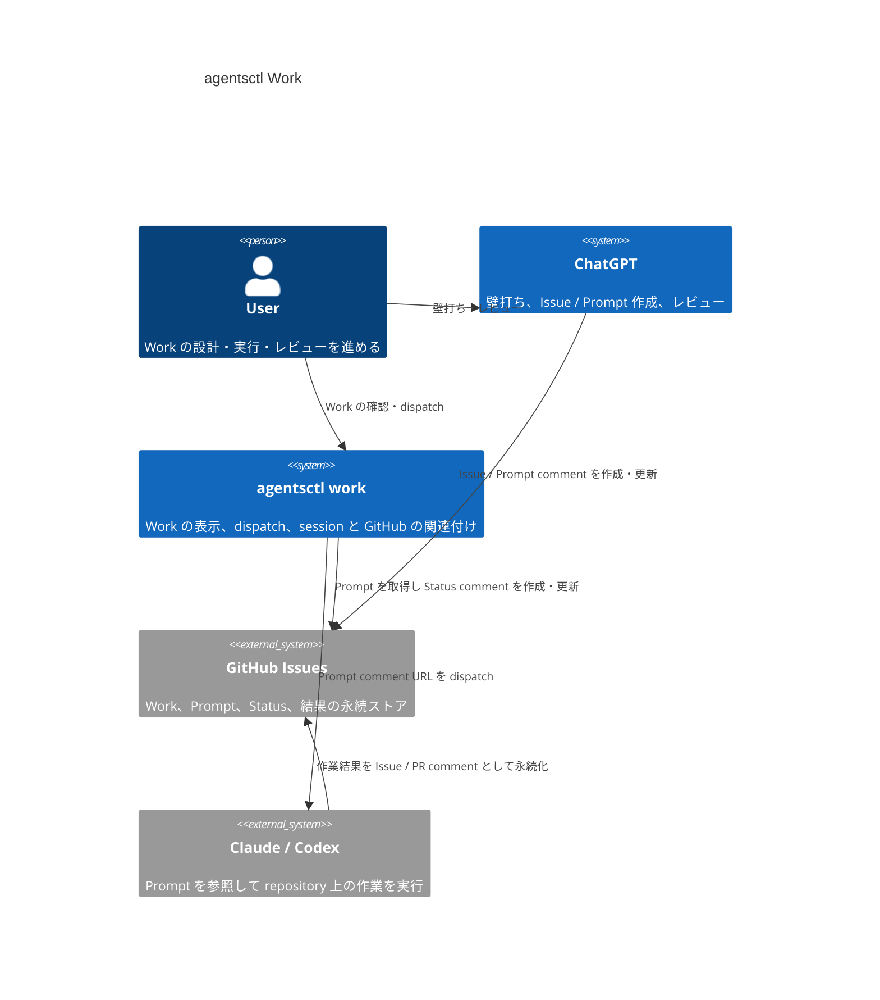

# DesignDoc: Work

**Document Status:** Draft  
**Development Status:** TBD

## Abstract/Summary

Work は、GitHub Issue を永続的な Work の記録として利用し、ChatGPT での壁打ち・Prompt 作成から Claude / Codex での実行、結果確認、レビュー、修正までを継続的に追跡する `agentsctl work` の設計である。

agentsctl は Work の実行内容そのものを保持せず、GitHub Issue 上の Prompt comment と Status comment を source of truth として扱う。manual dispatch と将来の auto dispatch は同じ dispatch pipeline を利用し、1 Issue につき最大1つの active dispatch を維持する。

### Core Model

| Concept | Design |
| --- | --- |
| Work identity | Repository + GitHub Issue |
| Source of truth | GitHub Issue / comments |
| Prompt | `agentsctl-work` metadata を持つ Prompt comment |
| Execution record | 1 dispatch につき1つの Status comment |
| Concurrency | 1 Issue につき最大1 active dispatch |
| Repository | Work 作成時に確定 |
| Worktree | agentsctl では管理せず、Prompt / coding agent に委ねる |
| Manual execution | `/dispatch` |
| Work creation + execution | `/work-dispatch` |
| Repository auto | `/auto` |
| Issue auto | `/work-auto` で repository policy を override |
| Automatic retry | usage limit による interruption の continuation のみ |

### Related Documents

- [DesignDoc: agentsctl](DesignDoc.md)

## Background

agentsctl と third-score のように複数 repository の開発を並行し、さらに1つの repository 内でも ChatGPT、Claude、Codex の複数 session を行き来すると、現在どの Work が誰の処理を待っているかを把握しづらくなる。

ChatGPT で壁打ちして作成した Prompt を coding agent へ渡し、完了後に ChatGPT でレビューする現在の loop では、Prompt の内容や実行結果が chat session と terminal session に分散する。Prompt の copy / paste を自動化しても、どの repository、Issue、ChatGPT session、coding-agent session が同じ Work に属するかを復元できなければ、並行作業時の認知負荷は残る。

Work は、GitHub Issue に durable な handoff と execution record を残し、agentsctl がそれを現在の session catalog と結び付けて表示・dispatch できる状態を提供する。

## Goals

- 複数 repository と複数 agent session を並行していても、各 Work の現在状態と次に必要な行動を復元できるようにする。
- ChatGPT が作成した Prompt と coding agent の実行結果を、GitHub Issue 上で追跡可能にする。
- manual dispatch と将来の auto dispatch を同じ Work model と dispatch pipeline で扱えるようにする。
- agentsctl の local state を失っても、GitHub Issue と comments から Work の実行履歴を復元できるようにする。
- provider 固有の session lifecycle を維持しつつ、Work 単位では1 Issue 最大1 active dispatch を保証する。

## Lower-Priority Goals

- repository への Prompt comment 投稿を検知し、自動で dispatch する。
- provider の usage limit により中断した Work を、利用可能な別 provider へ自動で引き継ぐ。
- GitHub Issue 以外の Work store へ拡張できる境界を維持する。

## Non-Goals

- agentsctl が worktree を作成・選択・管理すること。
- failed session を自動 retry すること。
- 同一 Issue で複数 dispatch を並列実行すること。
- coding agent が repository 内で行う実装手順や branch / worktree strategy を agentsctl が決定すること。
- coding agent の最終出力を agentsctl が要約・再解釈すること。

## Proposed Design

Work は GitHub Issue を中心に、Prompt、dispatch、Status、review を直列に積み重ねる。agentsctl は GitHub 上の protocol comment と provider session を結び付け、利用者が Work の現在状態を復元し、必要な handoff を実行できるようにする。

### UX Design

#### Work lifecycle

Work の基本 lifecycle は以下とする。

1. ChatGPT で壁打ち・事前調査を行う。
2. GitHub Issue を作成する。
3. ChatGPT が coding agent 向け Prompt を作成し、Issue comment として投稿する。
4. agentsctl で Work を作成し、Prompt を dispatch する。
5. coding agent が Prompt を参照して作業し、成果を push または Issue / PR comment として永続化する。
6. session 終了時に agentsctl が Status comment を更新する。
7. ChatGPT で結果をレビューする。
8. 修正が必要な場合は新しい Prompt comment を投稿し、同じ loop を繰り返す。

dispatch 前の Prompt comment は修正可能とする。ChatGPT 側の `agentsctl-work` skill は、同じ Issue に未着手 Prompt がある場合、新しい Prompt を追加するのではなく原則としてその comment を更新する。

Prompt に対応する Status comment が作成された後は、その Prompt を dispatch 済みの execution artifact とみなす。通常の修正は既存 Prompt を書き換えず、新しい Prompt comment として追加する。dispatch 済み Prompt の変更を要求された場合は、execution history が変わるため ChatGPT 側で確認を取る。

#### Work creation

Work 作成時は、選択中の ChatGPT session と repository + Issue を関連付ける。

```text
/work #<issue-number> [name]
```

`name` は省略可能とし、Tab で選択中 ChatGPT session の name を placeholder として利用できるようにする。

Work 作成時に確定する filesystem context は repository までとする。worktree の作成・選択は Prompt の指示と coding agent の判断へ委ねる。

Work 作成直後に続けて dispatch する操作は shorthand として提供する。

```text
/work-dispatch #<issue-number> [name]
```

`/work-dispatch` は `/work` と `/dispatch` と同じ pipeline を順に実行し、独自の dispatch semantics は持たない。

#### Dispatch

`/dispatch` は Work の Issue から `agentsctl-work` Prompt comment を取得し、Status comment が存在しない未着手 Prompt を dispatch 対象とする。

未着手 Prompt が1件の場合は、その Prompt をそのまま使用する。複数ある場合は、投稿時刻の降順で selection UI を表示し、利用者が dispatch 対象を選択する。

dispatch 時に coding agent へ渡す instruction は、Prompt 本文を転記せず Prompt comment URL を参照する短い指示を基本とする。

```text
<prompt-comment-url> の指示に従い、作業を進めてください。
```

同一 Issue に active dispatch が存在する間は、新しい dispatch を開始しない。新しい Prompt comment が追加されても pending のまま保持し、現在の dispatch が終了した後に次の dispatch 対象となる。

#### Work status and feedback

1回の dispatch は1つの Status comment を持つ。

dispatch 開始時には以下のような visible text を持つ Status comment を作成する。

```text
agentsctl running...
```

session が終了したら、同じ Status comment を更新する。正常終了時は session status と最終出力を人間がそのまま読める形で表示する。

```text
agentsctl worked.

Status: <session-status>

Result:
```
<final-output>
```
```

Status と Result は hidden metadata に閉じず、Issue を直接見ても実行結果を判断できるようにする。最終出力は agentsctl が要約せず、provider session から取得した値を機械的に保存する。

failed session は Status comment に失敗状態と取得可能な最終出力を残すが、自動 retry しない。

provider の usage limit による停止は通常の failed / completed と区別し、continuation の対象となる interruption として表示する。

#### Work listing and scope

`agentsctl work` の一覧 scope は既存 Agent View と同じ切り替えを利用する。

```text
current directory
→ current directory + descendants + worktrees
→ all
```

Work は repository + Issue を identity とし、その下に関連する ChatGPT / Claude / Codex session を関連付ける。

repository-wide auto が有効な場合は、Issue の取得と Issue number を含む ChatGPT session の grouping を利用して Work を自動構成できるようにする。明示的な Work association がある場合は、それを session name からの推定より優先する。

#### Automatic dispatch

自動化は manual `/dispatch` と別の execution path を作らず、同じ dispatch pipeline を event から起動する。

repository 単位の auto policy は、選択中 session の folder から repository を確定し、`/auto` で切り替える。

Issue 単位では `/work-auto` によって repository policy を override する。Issue policy は conceptual に以下の3状態を持つ。

- inherit
- on
- off

repository auto が有効で、新しい未着手 Prompt comment の投稿を検知した場合、その comment を直接 dispatch 対象として扱う。

agentsctl 起動前から複数の未着手 Prompt が存在し、投稿 event と対象 Prompt を一意に対応付けられない場合は、自動で選択せず利用者の選択を要求する。

#### Usage limit failover

自動 failover は provider の usage limit による interruption の場合だけ行う。通常の failed session は対象外とする。

usage limit を検知した場合は、まず現在の Status comment を interruption として確定し、active dispatch を終了させる。その後、元 Prompt と直前の Status comment を参照する continuation Prompt comment を自動生成する。

continuation Prompt は、新しい設計判断を agentsctl が行うためのものではなく、既存 Work の続きから作業を再開するための定型 handoff とする。

別 provider が利用可能で auto policy が許可している場合は、continuation Prompt を同じ dispatch pipeline へ渡す。利用可能な provider がない場合は未着手 Prompt として保持し、Work を waiting state とする。

### Implementation Design

#### Landscape



GitHub Issues は Work の durable source of truth を担い、agentsctl の local state は現在の UI / session association と policy を補助する。Prompt 本文や最終実行結果を agentsctl 独自 store のみに保持しない。

#### Work model

Work の identity は repository + GitHub Issue とする。

```text
Work
├── Repository
├── Issue
├── ChatGPT session(s)
├── Prompt comment(s)
├── Status comment(s)
└── Claude / Codex session(s)
```

repository は Work 作成時に確定する。worktree は Work model に含めず、各 Prompt と coding agent の実行方針に委ねる。

Issue の open / closed state と Work execution state は同一視しない。Work execution state は Prompt / Status comments と active session から導出する。

#### GitHub Work protocol

GitHub Issue では通常の人間向け discussion と Work protocol comment が共存する。protocol comment は HTML comment 内の `agentsctl-work` marker で明示し、agentsctl が本文の自然言語を推測して判定しないようにする。

##### Prompt comment

Prompt comment は coding agent に渡す実行指示を本文として持ち、hidden metadata で protocol comment であることを示す。

```md
<Prompt body>

<!--
agentsctl-work
type: prompt
version: 1
-->
```

未着手 Prompt は、その comment を参照する Status comment が存在しない Prompt とする。

##### Status comment

Status comment は1回の dispatch を表し、対応する Prompt comment を hidden metadata で参照する。

```md
agentsctl running...

<!--
agentsctl-work
type: status
version: 1
prompt-comment: <comment-id>
provider: <provider>
session-id: <session-id>
state: running
-->
```

session 終了時は同じ comment を更新し、visible な Status / Result と hidden metadata の execution state を同期する。

```md
agentsctl worked.

Status: Completed

Result:
```
<final-output>
```

<!--
agentsctl-work
type: status
version: 1
prompt-comment: <comment-id>
provider: <provider>
session-id: <session-id>
state: completed
-->
```

exact field set と state vocabulary は implementation spike で確定するが、Prompt と Status の関連を comment の並び順だけに依存させない。

#### Dispatch pipeline

manual / automatic trigger は、いずれも同じ dispatch pipeline を利用する。

```text
Trigger
  ↓
Resolve Work
  ↓
Select eligible Prompt
  ↓
Check active dispatch
  ↓
Create Status comment
  ↓
Start provider session
  ↓
Observe session completion
  ↓
Update Status comment
```

Status comment の作成は、その Prompt に対する dispatch が開始されたことを GitHub 上へ記録する boundary となる。

##### Dispatch invariant

1 Issue につき active dispatch は最大1つとする。

auto event と manual `/dispatch` が近接して発生しても、active dispatch の有無を確認する共通 gate を通す。Status comment と local runtime state の整合性を利用して、同一 Issue の二重 dispatch を避ける。

##### Prompt selection

manual dispatch では以下の規則を用いる。

- 未着手 Prompt が0件: dispatch しない。
- 未着手 Prompt が1件: その Prompt を使用する。
- 未着手 Prompt が複数件: 投稿日時の降順で selection UI を表示する。

auto dispatch では、新規投稿 event が一意の Prompt comment を指す場合はその Prompt を使用する。既存の未着手 Prompt が複数あり、一意に選べない場合は auto dispatch しない。

##### Completion

agentsctl は provider session の終了状態と取得可能な最終出力を取得し、対応する Status comment を更新する。

completion category は少なくとも以下を区別できるようにする。

- completed
- failed
- usage-limit interruption
- stopped / unknown など provider が明示するその他の終了状態

failed は自動 retry しない。usage-limit interruption だけが automatic continuation の入力となる。

#### Automation

auto policy は dispatch semantics ではなく trigger policy として扱う。

`/auto` は選択中 session の folder が属する repository に対する repository-level policy を変更する。`/work-auto` は個別 Issue の policy を変更し、repository policy を inherit / override する。

auto policy が有効でも、1 Issue 最大1 active dispatch、Prompt eligibility、provider availability といった dispatch invariant は manual dispatch と同じものを利用する。

#### State recovery

agentsctl 起動時は GitHub Issue と protocol comments から、少なくとも以下を再構成できるようにする。

- Work に属する Prompt comments。
- 各 Prompt の dispatch 有無。
- active / completed / failed / interrupted execution。
- provider と session identity。
- 未着手 Prompt の有無。

session catalog から同じ provider session を再発見できる場合は Work へ再関連付けする。session を再発見できない場合でも、GitHub 上の execution history は失わない。

local-only な auto policy、明示的 session association、表示 state の永続化方法は implementation design で確定する。

## Alternatives Considered

### Local Work store

agentsctl 独自の database を Work の source of truth とする案。

Prompt、結果、review の durable history が agentsctl の外から見えず、local state を失ったときに Work を復元しづらいため採用しない。GitHub Issue を durable record とし、local state は UI と runtime association の補助に限定する。

### Prompt comment に execution state を持たせる

Prompt comment 自体を `running` / `completed` へ書き換える案。

実行された指示と execution status の責務が混ざり、dispatch 後の Prompt を immutable artifact として扱いづらくなるため採用しない。Prompt と Status を別 comment とする。

### Reaction だけで execution state を表現する

Prompt comment への reaction を Pending / Running / Completed の state として利用する案。

reaction は人間も通常の意思表示として利用でき、実行結果や provider/session identity を十分に記録できない。補助的な feedback に利用する余地は残すが、protocol state の source of truth にはしない。

### agentsctl が worktree を管理する

Work と特定 worktree を agentsctl が固定的に関連付ける案。

Prompt ごとに worktree strategy が異なり、coding agent 側で既存 branch / worktree を調査して継続する必要もある。Work の identity は repository + Issue に留め、worktree は execution instruction に委ねる。

## Open Questions

- Prompt / Status comment の protocol metadata field と versioning をどこまで MVP で固定するか。
- GitHub の新規 Prompt comment を監視する方式を polling / event integration のどちらにするか。
- provider 固有 status を Work の completion category へ mapping する詳細。
- repository auto で自動実行を許可する Prompt author / trust boundary。
- repository / Issue auto policy と明示的 session association の local persistence 形式。
- usage limit 後の provider selection order と availability 判定の詳細。
